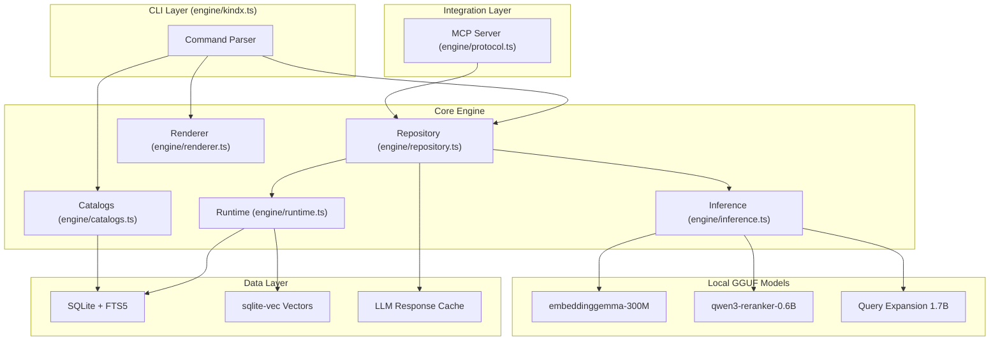
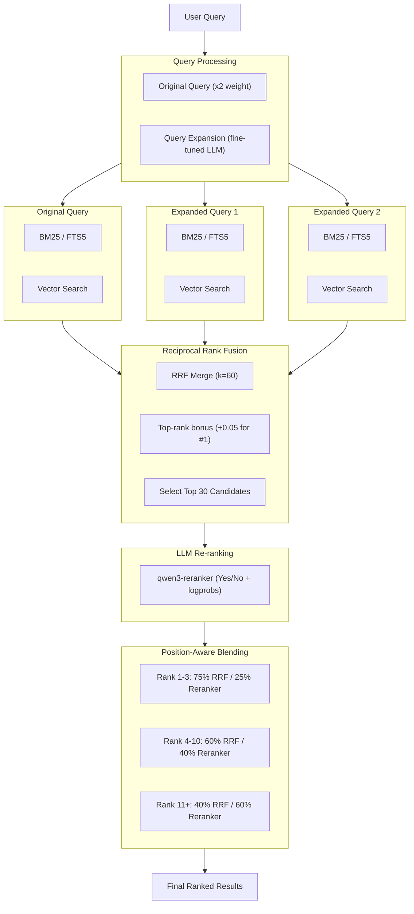
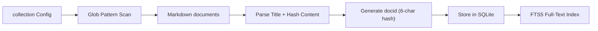
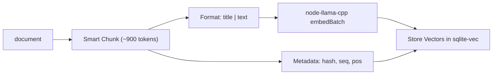

```
 ██╗  ██╗██╗███╗   ██╗██████╗ ██╗  ██╗
 ██║ ██╔╝██║████╗  ██║██╔══██╗╚██╗██╔╝
 █████╔╝ ██║██╔██╗ ██║██║  ██║ ╚███╔╝
 ██╔═██╗ ██║██║╚██╗██║██║  ██║ ██╔██╗
 ██║  ██╗██║██║ ╚████║██████╔╝██╔╝ ██╗
 ╚═╝  ╚═╝╚═╝╚═╝  ╚═══╝╚═════╝ ╚═╝  ╚═╝
```

# KINDX — Production-Quality On-Device Knowledge Infrastructure

[](https://modelcontextprotocol.io)
[](https://github.com/ambicuity/KINDX)
[](https://nodejs.org)
[](https://www.typescriptlang.org)
[](./LICENSE)
[](https://scorecard.dev/viewer/?uri=github.com/ambicuity/KINDX)

**Knowledge Infrastructure for AI Agents.** KINDX is a high-performance, local-first backend for Agentic Context Injection — enabling AI agents to perform deterministic, privacy-preserving Contextual Retrieval over document corpora without a single byte leaving the edge.

KINDX combines BM25 full-text retrieval, vector semantic retrieval, and LLM re-ranking — all running locally via `node-llama-cpp` with GGUF models. It is designed to be called by agents, not typed by humans.

| Capability | Status |
|---|:---:|
| Hybrid BM25 + Vector + LLM Rerank | ✅ Implemented |
| Encryption at rest (SQLCipher) | ✅ Implemented |
| ANN index (centroid-based sharding) | ✅ Implemented |
| Prometheus `/metrics` + structured logging | ✅ Implemented |
| Diagnostics (`doctor`, `backup`, `repair`) | ✅ Implemented |
| Multi-format ingestion (PDF, DOCX, code) | ✅ Implemented |
| Bounded LLM concurrency pool | ✅ Implemented |
| Multi-tenant isolation / RBAC | ✅ Implemented |

> Read the progress log in the [CHANGELOG](./CHANGELOG.md).

---

## Why KINDX?

The local RAG ecosystem is fragmenting: LanceDB is moving to multimodal ML infrastructure, Chroma is moving to managed cloud, Orama is moving to the browser. **KINDX is the only tool that stays on the desktop and speaks the agent's native language.**

| Capability | KINDX | LanceDB | Chroma | Orama | Khoj |
|---|:---:|:---:|:---:|:---:|:---:|
| **Local-first / Air-gapped** | ✅ | ✅ | ❌ | ✅ | ✅ |
| **MCP Server (agent protocol)** | ✅ | ❌ | ❌ | ❌ | ❌ |
| **On-device GGUF inference** | ✅ | ❌ | ❌ | ❌ | Partial |
| **Hybrid BM25 + Vector + Rerank** | ✅ | Partial | Partial | ✅ | ❌ |
| **Structured agent output (JSON/CSV/XML)** | ✅ | ❌ | ❌ | ❌ | ❌ |
| **CLI-first / `child_process` invocable** | ✅ | ❌ | ❌ | ❌ | ❌ |

KINDX is the only product in this category that combines local-first privacy, first-class MCP support, on-device GGUF inference, structured pipeline output, and CLI invocability — making it the ideal Memory Node for MCP-compatible autonomous agents (Claude Code, Cursor, Continue.dev, AutoGPT, and beyond).

---

## The Three Pillars

### 1. Deterministic Privacy
Every inference — embedding, reranking, query expansion — runs on local GGUF models via `node-llama-cpp`. Sensitive documents never leave the edge. There is no telemetry, no API call, no cloud dependency.

### 2. Agent-Native Design
KINDX is architected for `child_process` invocation from autonomous agents (AutoGPT, OpenDevin, Claude Code, LangGraph). The `--json`, `--files`, `--csv`, and `--xml` output flags produce structured payloads for agent consumption. The MCP server provides tight protocol-level integration.

### 3. Hybrid Precision (Neural-Symbolic Retrieval)
Position-Aware Blending merges BM25 symbolic retrieval with neural vector similarity and LLM cross-encoder reranking. The fusion strategy is provably non-destructive to exact-match signals via Reciprocal Rank Fusion (RRF, k=60). See the [Architecture](#architecture) section for the full pipeline specification.

---

## Quick Start — Local-First Agentic Stack

```bash
# Install globally (Node or Bun)
npm install -g @ambicuity/kindx
# or
bun install -g @ambicuity/kindx

# Or invoke without installing
npx @ambicuity/kindx ...
bunx @ambicuity/kindx ...

> **Note:** The term "collection" in this documentation corresponds to a `collection` in the CLI.

# Register collections
kindx collection add ~/notes --name notes
kindx collection add ~/Documents/meetings --name meetings
kindx collection add ~/work/docs --name docs

# Annotate collections with semantic context
kindx context add kindx://notes "Personal documents and ideation corpus"
kindx context add kindx://meetings "Meeting transcripts and decision records"
kindx context add kindx://docs "Engineering documentation corpus"

# Build the vector index from corpus
kindx embed

# Contextual Retrieval — choose retrieval mode
kindx search "project timeline"          # BM25 full-text retrieval (fast)
kindx vsearch "how to deploy"            # Neural vector retrieval
kindx query "quarterly planning process" # Hybrid + reranking (highest precision)

# Neural Extraction — retrieve a specific document
kindx get "meetings/2024-01-15.md"

# Neural Extraction by docid (shown in retrieval results)
kindx get "#abc123"

# Bulk Neural Extraction via glob pattern
kindx multi-get "journals/2025-05*.md"

# Scoped Contextual Retrieval within a collection
kindx search "API" -c notes

# Export full match set for agent pipeline
kindx search "API" --all --files --min-score 0.3

> **Pro-tip (Small Collections):** For collections under ~100 documents, `kindx search` (BM25) is incredibly fast and often sufficient. The query expansion and reranking overhead of `kindx query` is best suited for larger, noisier corporate datasets.
```

---

## Agent-Native Integration

KINDX's primary interface is structured output for agent pipelines. Treat CLI invocations as RPC calls.

```bash
# Structured JSON payload for LLM context injection
kindx search "authentication" --json -n 10

# Filepath manifest above relevance threshold — agent file consumption
kindx query "error handling" --all --files --min-score 0.4

# Full document content for agent context window
kindx get "docs/api-reference.md" --full
```

> **Pro-tip (Agentic Performance):** Prefer `kindx query` over `kindx search` for open-ended agent instructions. The query expansion and LLM re-ranking pipeline surfaces semantically adjacent documents that keyword retrieval misses.

> **Pro-tip (Context Window Budgeting):** Use `--min-score 0.4` with `--files` to produce a ranked manifest, then `multi-get` only the top-k assets. This two-phase pattern prevents context window overflow while preserving retrieval precision.

### Typed SDK Packages

KINDX now includes typed client packages and integration scaffolding:

- `@ambicuity/kindx-schemas` — shared Zod schemas for KINDX MCP/HTTP request and response contracts.
- `@ambicuity/kindx-client` — TypeScript client for `/query` and MCP tool calls (`get`, `multi_get`, `status`, and memory tools).
- `python/kindx-langchain` — installable Python retriever wrapper for LangChain-style document retrieval.
- [`reference/integrations/agent-templates.md`](reference/integrations/agent-templates.md) — tested MCP configuration templates for OpenDevin, Goose, and Claude Code.

---

## MCP Server

KINDX exposes a Model Context Protocol (MCP) server for tool-call integration with any MCP-compatible agent runtime.

**Registered Tools:**
- `query` — Hybrid structured retrieval over `lex`/`vec`/`hyde` sub-queries
- `get` — Retrieve one document by path/docid
- `multi_get` — Bulk retrieval by glob/list/docids
- `status` — Index and capability health
- `arch_status`, `arch_query` — Optional Arch sidecar status/hints
- `memory_put`, `memory_search`, `memory_history`, `memory_stats`, `memory_mark_accessed` — Scoped memory lifecycle tools

**Claude Desktop configuration** (`~/Library/Application Support/Claude/claude_desktop_config.json`):

```json
{
  "mcpServers": {
    "kindx": {
      "command": "kindx",
      "args": ["mcp"]
    }
  }
}
```

### HTTP Transport

By default, the MCP server uses stdio (launched as a subprocess per client). For a shared, long-lived server that avoids repeated model loading across agent sessions, use the HTTP transport:

```bash
# Foreground
kindx mcp --http                # localhost:8181
kindx mcp --http --port 8080    # custom port

# Persistent daemon
kindx mcp --http --daemon       # writes PID to ~/.cache/kindx/mcp.pid
kindx mcp stop                  # terminate via PID file
kindx status                    # reports "MCP: running (PID ...)"
```

Endpoints:
- `POST /mcp` — MCP Streamable HTTP (JSON, stateless)
- `POST /query` (alias `/search`) — direct structured retrieval endpoint
- `GET /health` — liveness probe with uptime
- `GET /metrics` — Prometheus metrics for request/retrieval/runtime health

Authentication notes:
- HTTP mode requires `Authorization: Bearer <token>` for `/mcp`, `/query`, and `/search`.
- If `KINDX_MCP_TOKEN` is unset, KINDX auto-generates a token and stores it at `~/.config/kindx/mcp_token`.
- `/health` is intentionally unauthenticated for liveness probes.

LLM models remain resident in VRAM across requests. Embedding and reranking contexts are disposed after 5 min idle and transparently recreated on next request (~1 s penalty, models remain warm).

Point any MCP client at `http://localhost:8181/mcp`.

> **Pro-tip (Multi-Agent Deployments):** Run `kindx mcp --http --daemon` once at agent-cluster startup. All child agents share a single warm model context, eliminating per-invocation model load overhead (~3–8 s per cold start).

### Release Readiness Notes (Agentic Hardening)

- Session lifecycle is now explicitly managed per MCP connection, with cleanup on disconnect.
- Tool execution responses are standardized for success/error shape consistency.
- MCP initialize may include bounded workspace memory summaries when scoped memories exist.
- Structured vector fan-out runs concurrently but merges in deterministic order for stable rankings.

Risk notes for constrained hosts:
- If local model initialization fails (VRAM/Metal/CUDA limits), force CPU fallback:
  - `KINDX_CPU_ONLY=1 kindx query "..."`.
- Closed MCP sessions must not be reused by clients (`mcp-session-id` becomes invalid).

Benchmark helper (release gate evidence):

```bash
tsx tooling/benchmark_release_hardening.ts --collection docs --query "auth token flow" --runs 5
```

Audit artifacts:
- `reference/audits/release-readiness-hardening-2026-04-02.md`
- `reference/audits/release-readiness-benchmarks-2026-04-02.md`
- `reference/runbooks/operating-modes.md`
- `reference/runbooks/customer-pov-launch-readiness.md`
- `reference/runbooks/customer-pov-evidence-template.md`

---

## Multi-Tenant RBAC

KINDX supports multi-tenant isolation with role-based access control for shared HTTP MCP deployments. When enabled, each bearer token resolves to a tenant with a specific role and collection-scoped access.

### Roles

| Role | Query | Get | Memory Write | Embed/Update | Collection Manage | Backup | Tenant Manage |
|------|:-----:|:---:|:------------:|:------------:|:-----------------:|:------:|:-------------:|
| `admin` | ✅ all | ✅ all | ✅ | ✅ | ✅ | ✅ | ✅ |
| `editor` | ✅ assigned | ✅ assigned | ✅ | ✅ assigned | ❌ | ❌ | ❌ |
| `viewer` | ✅ assigned | ✅ assigned | ❌ | ❌ | ❌ | ❌ | ❌ |

### Tenant Management

```bash
# Create a viewer tenant for CI — shows token once (save it)
kindx tenant add ci-bot --role viewer docs notes

# Create an editor for a team lead
kindx tenant add team-lead --role editor --name "Team Lead" docs notes meetings

# Create an admin
kindx tenant add platform-admin --role admin

# List all tenants
kindx tenant list

# Grant additional collection access
kindx tenant grant ci-bot meetings

# Revoke access
kindx tenant revoke ci-bot meetings

# Rotate a compromised token
kindx tenant rotate ci-bot

# Disable a tenant (token is rejected immediately)
kindx tenant disable ci-bot

# Re-enable
kindx tenant enable ci-bot

# Show RBAC status
kindx tenant status
```

### Token Security

- Tokens are generated as 32-byte cryptographically random hex strings.
- Only SHA-256 hashes are stored in `~/.config/kindx/tenants.yml` — plaintext tokens are shown once at creation time and cannot be recovered.
- Token rotation generates a new token and invalidates the old one atomically.
- Disabled tenants are rejected at the auth layer before any resource access.

### Backward Compatibility

- **No `tenants.yml`**: KINDX operates in single-tenant mode. `KINDX_MCP_TOKEN` (or auto-generated token) provides admin-level access. No behavior change.
- **With `tenants.yml`**: Multi-tenant RBAC is active. Each bearer token maps to a tenant identity. Unknown tokens receive 403 Forbidden.

### Collection Isolation

Tenants can only query, get, and retrieve documents from their assigned collections:

```bash
# Tenant ci-bot (viewer, collections: docs, notes)
curl -H "Authorization: Bearer <ci-bot-token>" \
  -X POST http://localhost:8181/query \
  -d '{"searches": [{"type": "lex", "query": "API"}], "collections": ["docs", "secret"]}'
# → "secret" is silently filtered out; only "docs" results returned
```

> **Pro-tip (Shared Agent Clusters):** Run `kindx mcp --http --daemon` with multi-tenant RBAC to give each agent team its own scoped view of the knowledge base. CI bots get read-only viewer tokens; development agents get scoped editor tokens.

---

## Architecture

### Component Overview



### Hybrid Retrieval Pipeline



### Score Normalization and Fusion

#### Retrieval Backends

- **BM25 (FTS5)**: `Math.abs(score)` normalized via `score / 10`
- **Vector retrieval**: `1 / (1 + distance)` cosine similarity

#### Fusion Strategy

The `query` command uses Reciprocal Rank Fusion (RRF) with position-aware blending:

1. **Query Expansion**: Original query (x2 for weighting) + 1 LLM variation
2. **Parallel Retrieval**: Each query searches both FTS and vector indexes
3. **RRF Fusion**: Combine all result lists using `score = Sum(1/(k+rank+1))` where k=60
4. **Top-Rank Bonus**: documents ranking #1 in any list get +0.05, #2-3 get +0.02
5. **Top-K Selection**: Take top 30 candidates for reranking
6. **Re-ranking**: LLM scores each asset (yes/no with logprobs confidence)
7. **Position-Aware Blending**:
   - RRF rank 1-3: 75% retrieval, 25% reranker (preserves exact matches)
   - RRF rank 4-10: 60% retrieval, 40% reranker
   - RRF rank 11+: 40% retrieval, 60% reranker (trust reranker more)

**Design rationale:** Pure RRF can dilute exact matches when expanded queries don't match. The top-rank bonus preserves documents that score #1 for the original query. Position-aware blending prevents the reranker from overriding high-confidence retrieval signals.

---

## Requirements

### System Requirements

- Node.js >= 20
- Bun >= 1.0.0
- macOS: Homebrew SQLite (for extension support)

```bash
brew install sqlite
```

### WSL2 GPU Support (Windows)

If you are running KINDX inside WSL2 with an NVIDIA GPU, `node-llama-cpp` might fall back to the slow, non-conformant Vulkan translation layer (`dzn`) causing `vsearch` and `query` to take 60-90 seconds or crash.

To enable native CUDA GPU acceleration, install the CUDA toolkit runtime libraries (do *not* install the driver meta-packages, WSL2 passes the driver through from Windows):

```bash
wget https://developer.download.nvidia.com/compute/cuda/repos/wsl-ubuntu/x86_64/cuda-keyring_1.1-1_all.deb
sudo dpkg -i cuda-keyring_1.1-1_all.deb
sudo apt-get update
sudo apt-get install cuda-toolkit-13-1  # or cuda-toolkit-12-6
```

### GGUF Models (via node-llama-cpp)

KINDX uses three local GGUF models (auto-downloaded on first use):

- `embeddinggemma-300M-Q8_0` — embedding model
- `qwen3-reranker-0.6b-q8_0` — cross-encoder reranker
- `LFM2.5-1.2B-Instruct-Q4_K_M` — query expansion (LiquidAI LFM2)

Models are downloaded from HuggingFace and cached in `~/.cache/kindx/models/`.

> **Pro-tip (Air-Gapped Deployments):** Pre-download all three GGUF files and place them in `~/.cache/kindx/models/`. KINDX resolves models from the local cache first; no network access is required at runtime.

### Custom Embedding Model

Override the default embedding model via the `KINDX_EMBED_MODEL` environment variable. Required for multilingual corpora (CJK, Arabic, etc.) where `embeddinggemma-300M` has limited coverage.

BM25 keyword search now normalizes CJK text at both index and query time (with `Intl.Segmenter` plus CJK bigram fallback), so `kindx search` remains effective even for contiguous Chinese/Japanese/Korean text without whitespace.

```bash
# Use Qwen3-Embedding-0.6B for multilingual corpus (CJK) support
export KINDX_EMBED_MODEL="hf:Qwen/Qwen3-Embedding-0.6B-GGUF/qwen3-embedding-0.6b-Q8_0.gguf"

# Force re-embed all documents after model switch
kindx embed -f
```

Supported model families:

| Model | Use Case |
|---|---|
| `embeddinggemma` (default) | English-optimized, minimal footprint |
| `Qwen3-Embedding` | Multilingual (119 languages including CJK), MTEB top-ranked |

> **Note:** Switching embedding models requires full re-indexing (`kindx embed -f`). Vectors are model-specific and not cross-compatible. The prompt format is automatically adjusted per model family.

---

## Installation

```bash
npm install -g @ambicuity/kindx
# or
bun install -g @ambicuity/kindx
```

### Development

```bash
git clone https://github.com/ambicuity/KINDX
cd KINDX
npm install
npm link
```

### Troubleshooting: Permission Errors (`EACCES`)

If you see `npm error code EACCES` when running `npm install -g`, your system npm is configured to write to a directory owned by root (e.g. `/usr/local/lib/node_modules`). **Do not use `sudo npm install -g`** — this is a security risk.

The recommended fix is to use a Node version manager so that npm writes to a user-owned prefix:

**Option 1 — `nvm` (most common)**

```bash
# Install nvm
curl -o- https://raw.githubusercontent.com/nvm-sh/nvm/v0.40.2/install.sh | bash
# Restart your shell, then:
nvm install --lts
nvm use --lts
npm install -g @ambicuity/kindx
```

**Option 2 — `mise` (polyglot version manager)**

```bash
# Install mise
curl https://mise.run | sh
# Restart your shell, then:
mise use -g node@lts
npm install -g @ambicuity/kindx
```

**Option 3 — configure a user-writable npm prefix**

```bash
mkdir -p ~/.npm-global
npm config set prefix ~/.npm-global
# Add to your shell profile (~/.zshrc or ~/.bashrc):
export PATH="$HOME/.npm-global/bin:$PATH"
# Then:
npm install -g @ambicuity/kindx
```

After any of the above, `kindx --version` should print the installed version.

### Troubleshooting: Local LLM Context Init Failures

If `kindx embed` or `kindx query` fails with messages like `Failed to create any embedding context`, `Failed to create any rerank context`, or low-level `ggml`/`metal` allocation errors:

1. KINDX now automatically retries once in CPU-only mode when local context initialization fails.
2. You can force CPU mode explicitly for deterministic behavior:

```bash
KINDX_CPU_ONLY=1 kindx embed
KINDX_CPU_ONLY=1 kindx query "your query"
```

3. If local models remain unstable, use remote backend mode:

```bash
KINDX_LLM_BACKEND=remote kindx query "your query"
```

### Troubleshooting: Ingestion / Watch / Embed Lifecycle

If retrieval quality drops unexpectedly after file edits, validate the full lifecycle:

1. `kindx update` refreshes indexed content and extraction metadata.
2. `kindx watch` keeps incremental changes synchronized in near real time.
3. `kindx embed` refreshes vectors for new/changed content hashes.

Quick checks:
- Run `kindx status` and review `Needs embedding` and ingestion warning counts.
- For extractor-related issues (`pdf`/`docx`), verify:
  - `KINDX_EXTRACTOR_PDF=1`
  - `KINDX_EXTRACTOR_DOCX=1`
  - `KINDX_EXTRACTOR_FALLBACK_POLICY=fallback` (or `strict`)
- If `kindx watch` is active for multiple collections, use `kindx scheduler status` and `/metrics` to identify queue pressure before increasing rerank limits.

### Troubleshooting: MCP HTTP Bind

`kindx mcp --http` attempts to bind `localhost` first, then falls back to `127.0.0.1` if localhost binding is restricted by the host environment.

## Usage Reference

### Command Index

Top-level commands:

```bash
kindx query <query>          # Hybrid search with expansion + reranking
kindx search <query>         # BM25 full-text search
kindx vsearch <query>        # Vector similarity search
kindx get <file> [--from N]  # Retrieve one document (optionally from line offset)
kindx multi-get <pattern>    # Retrieve many documents by glob/list/docid
kindx embed                  # Generate or refresh embeddings
kindx pull                   # Download/check the default local models
kindx update                 # Re-index configured collections
kindx watch                  # Keep the index fresh in the background
kindx status                 # Report index, collection, and MCP health
kindx doctor                 # Deterministic diagnostics (vec/model/integrity/WAL/trust)
kindx repair --check-only    # Dry-run repair checks
kindx backup create [path]   # Create SQLite backup snapshot
kindx backup verify <path>   # Verify backup integrity
kindx backup restore <path>  # Restore backup to active index (use --force to overwrite)
kindx scheduler status        # Show shard sync checkpoint/runtime warnings
kindx cleanup                # Clear caches, orphaned rows, and vacuum the DB
kindx cleanup --cache        # Clear only LLM + semantic query caches
kindx mcp                    # Start the MCP server (stdio by default)
kindx tenant <subcommand>    # Multi-tenant RBAC management
kindx migrate <target> <path> # Import from Chroma or OpenCLAW
kindx skill install          # Install the packaged Claude skill locally
kindx --skill                # Print the packaged skill markdown
kindx --version              # Print the installed CLI version
```

KINDX opens SQLite indexes with `journal_mode=WAL` and `busy_timeout=30000`, so background writers
(for example `kindx watch`) and MCP readers can run concurrently with fewer lock conflicts.

Tenant subcommands:

```bash
kindx tenant add <id> [collections...] --role <admin|editor|viewer>
kindx tenant remove <id>
kindx tenant list
kindx tenant show <id>
kindx tenant rotate <id>
kindx tenant grant <id> <col1> [col2 ...]
kindx tenant revoke <id> <col1> [col2 ...]
kindx tenant disable <id>
kindx tenant enable <id>
kindx tenant status
```

Collection subcommands:

```bash
kindx collection add <path> [--name NAME] [--mask GLOB]
kindx collection list
kindx collection show <name>
kindx collection remove <name>
kindx collection rename <old> <new>
kindx collection update-cmd <name> [command]
kindx collection include <name>
kindx collection exclude <name>
```

Context and MCP subcommands:

```bash
kindx context add [path] "text"
kindx context list
kindx context rm <path>

kindx mcp --http
kindx mcp --http --daemon
kindx mcp --http --log-format json --log-level INFO
kindx mcp stop
```

Phase 2 scale controls (optional, additive):

```bash
# query-time rerank budgeting
kindx query \"distributed tracing\" --max-rerank-candidates 24 --rerank-timeout-ms 2500

# resumable shard sync during embed
kindx embed --resume
```

P2 runtime contracts (stable):

```bash
# Encryption-at-rest (auto-migrate plaintext index + shard dbs in place)
export KINDX_ENCRYPTION_KEY="replace-with-strong-key"

# Force sqlite runtime driver (default probes sqlcipher-capable first)
export KINDX_SQLITE_DRIVER="better-sqlite3-multiple-ciphers"

# ANN tuning
export KINDX_ANN_ENABLE=1
export KINDX_ANN_PROBE_COUNT=4
export KINDX_ANN_SHORTLIST=200

# Extractor policy
export KINDX_EXTRACTOR_PDF=1
export KINDX_EXTRACTOR_DOCX=1
export KINDX_EXTRACTOR_FALLBACK_POLICY=fallback   # or strict

# LLM concurrency pool (multi-agent throughput)
export KINDX_LLM_POOL_SIZE=2  # concurrent LLM contexts (default: 1)
```

Stable `/metrics` names:
- `kindx_http_requests_total{route,method,status}`
- `kindx_http_request_duration_ms_bucket{route,method,le}`
- `kindx_query_requests_total{profile,degraded,route}`
- `kindx_query_degraded_total{reason}`
- `kindx_query_route_total{route}`
- `kindx_query_total_ms_bucket{profile,degraded,route,le}`
- `kindx_rerank_queue_depth`
- `kindx_rerank_queue_active`
- `kindx_rerank_queue_concurrency`
- `kindx_rerank_queue_timed_out_total`
- `kindx_rerank_queue_saturated_total`
- `kindx_llm_pool_size`
- `kindx_llm_pool_active`
- `kindx_llm_pool_waiting`
- `kindx_llm_pool_acquired_total`
- `kindx_llm_pool_timed_out_total`

### collection Management

```bash
# Register a collection from current directory
kindx collection add . --name myproject

# Register with explicit path and glob mask
kindx collection add ~/Documents/notes --name notes --mask "**/*.md"

# List all registered collections
kindx collection list

# Remove a collection
kindx collection remove myproject

# Rename a collection
kindx collection rename myproject my-project

# Show collection details and current settings
kindx collection show my-project

# Configure a pre-refresh command
kindx collection update-cmd my-project "git pull --ff-only"

# Include or exclude a collection from default queries
kindx collection include my-project
kindx collection exclude archive

# List documents within a domain
kindx ls notes
kindx ls notes/subfolder
```

### YAML Configuration

By default, collection settings are stored in `~/.config/kindx/index.yml`. The config directory is resolved as `KINDX_CONFIG_DIR` (if set), then `XDG_CONFIG_HOME/kindx` (if set), then `~/.config/kindx`. Named indexes use `~/.config/kindx/{indexName}.yml` (default: `index.yml`). You can edit this file directly to configure `ignore` patterns and glob rules for files that should be skipped during indexing and search.

#### Example

```yaml
collections:
  docs:
    path: ~/work/docs
    pattern: "**/*.md"
    ignore:
      - "archive/**"
      - "sessions/**"
      - "**/*.draft.md"
```

#### How it works

- `pattern` defines which files are included
- `ignore` excludes matching files and directories
- A file must match `pattern` **and not match any `ignore` rule** to be indexed
- Ignored files are skipped during indexing and will not appear in search results

#### Notes

- `ignore` is configured in YAML (no CLI support currently)
- Patterns are evaluated relative to the collection `path`.
- By default, `node_modules`, `.git`, `.cache`, `vendor`, `dist`, and `build` are already ignored; `ignore` adds custom exclusions.
- After editing `index.yml`, run `kindx update` to re-index with the updated rules.

### Vector Index Generation

```bash
# Embed changed/new chunks only (900 tokens/chunk, 15% overlap)
kindx embed

# Force re-embed entire corpus
kindx embed -f
```

`kindx embed` performs chunk-level incremental embedding. Progress is reported as `N changed / M total chunks`, and unchanged chunks are reused when possible.

### Context Management

Context annotations add semantic metadata to collections and paths, improving Contextual Retrieval precision.

```bash
# Annotate a collection (using kindx:// virtual paths)
kindx context add kindx://notes "Personal documents and ideation corpus"
kindx context add kindx://docs/api "API and integration documentation corpus"

# Annotate from within a corpus directory
cd ~/notes && kindx context add "Personal documents and ideas"
cd ~/notes/work && kindx context add "Work-related knowledge corpus"

# Add global context (applies across all collections)
kindx context add / "Enterprise knowledge base for agent context injection"

# List all context annotations
kindx context list

# Remove context annotation
kindx context rm kindx://notes/old
```

### Contextual Retrieval Commands

```
+------------------------------------------------------------+
| Retrieval Modes                                            |
+----------+-------------------------------------------------+
| search   | BM25 full-text retrieval only                  |
| vsearch  | Neural vector retrieval only                   |
| query    | Hybrid: FTS + Vector + Expansion + Rerank      |
+----------+-------------------------------------------------+
```

Quick mode chooser:
- Use `kindx search` for exact keywords, quoted phrases, and negation filters.
- Use `kindx vsearch` when you need semantic-only retrieval and can skip rerank overhead.
- Use `kindx query` as the default for agent workflows or ambiguous natural-language requests.
- Prefer HTTP MCP daemon (`kindx mcp --http --daemon`) when multiple agents share one warm runtime.

```bash
# Full-text Contextual Retrieval (fast, keyword-based)
kindx search "authentication flow"

# Neural vector Contextual Retrieval (semantic similarity)
kindx vsearch "how to login"

# Hybrid Neural-Symbolic retrieval with re-ranking (highest precision)
kindx query "user authentication"
```

### CLI Options

```bash
# Retrieval options
-n <num>           # Number of results (default: 5, or 20 for --files/--json)
-c, --collection   # Restrict retrieval to a specific collection
--all              # Return all matches (combine with --min-score to filter)
--min-score <num>  # Minimum relevance threshold (default: 0)
--full             # Return full document content
--line-numbers     # Annotate output with line numbers
--explain          # Include retrieval score traces (query, JSON/CLI output)
--index <name>     # Use named index

# Structured output formats (for agent pipeline consumption)
--files            # Output: docid,score,filepath,context
--json             # JSON payload with snippets
--csv              # CSV output
--md               # Markdown output
--xml              # XML output

# Neural Extraction options
kindx get <file>[:line]  # Extract document, optionally from line offset
-l <num>                 # Maximum lines to return
--from <num>             # Start from line number

# Bulk Neural Extraction options
-l <num>                 # Maximum lines per asset
--max-bytes <num>        # Skip assets larger than N bytes (default: 10KB)
```

### Index Maintenance

```bash
# Report index health and collection inventory
kindx status

# Re-index all collections
kindx update

# Re-index with upstream git pull (for remote corpus repos)
kindx update --pull

# Download/check the default local models
kindx pull

# Force re-download the default models
kindx pull --refresh

# Watch one or more collections for changes
kindx watch
kindx watch notes docs

# Neural Extraction by filepath (with fuzzy matching fallback)
kindx get notes/meeting.md

# Neural Extraction by docid (from retrieval results)
kindx get "#abc123"

# Extract document starting at line 50, max 100 lines
kindx get notes/meeting.md:50 -l 100

# Bulk Neural Extraction via glob pattern
kindx multi-get "journals/2025-05*.md"

# Bulk Neural Extraction via comma-separated list (supports docids)
kindx multi-get "doc1.md, doc2.md, #abc123"

# Limit bulk extraction to assets under 20KB
kindx multi-get "docs/*.md" --max-bytes 20480

# Export bulk extraction as JSON for agent processing
kindx multi-get "docs/*.md" --json

# Purge caches + orphaned index data
kindx cleanup

# Purge only LLM + semantic caches
kindx cleanup --cache

# Import an existing Chroma or OpenCLAW corpus
kindx migrate chroma /path/to/chroma.sqlite3
kindx migrate openclaw /path/to/openclaw/repo
```

### Claude Skill Packaging

```bash
# Print the packaged skill markdown
kindx --skill

# Install the packaged skill into ~/.claude/commands/
kindx skill install
```

---

## Data Storage

Index stored at: `~/.cache/kindx/index.sqlite`

### Schema

Core runtime tables (current implementation):
- `content(hash, doc, created_at)` — content-addressed document bodies.
- `documents(id, collection, path, title, hash, created_at, modified_at, active)` — file-system view over content hashes.
- `documents_fts(filepath, title, body)` — FTS5 lexical index kept in sync via triggers.
- `content_vectors(hash, seq, pos, model, embedded_at)` — chunk metadata for vectorized content.
- `vectors_vec(hash_seq, embedding)` — sqlite-vec virtual table (`vec0`) for ANN/exact vector search.
- `llm_cache(hash, result, created_at)` — cached expansion/rerank artifacts.
- `document_ingest(collection, path, format, extractor, warnings_json, extracted_at, content_hash)` — ingestion diagnostics.

Memory subsystem tables:
- `memories`, `memory_tags`, `memory_links`, `memory_embeddings`, `memory_vectors_vec`.

Collection definitions are YAML-backed (`~/.config/kindx/index.yml`), not stored in SQLite.

---

## Environment Variables

| Variable | Default | Description |
|----------|---------|-------------|
| `KINDX_EMBED_MODEL` | `hf:ggml-org/embeddinggemma-300M-GGUF/...` | Override embedding model (HuggingFace URI) |
| `KINDX_RERANK_MODEL` | `hf:ggml-org/Qwen3-Reranker-0.6B-Q8_0-GGUF/...` | Override reranker model |
| `KINDX_GENERATE_MODEL` | `hf:LiquidAI/LFM2.5-1.2B-Instruct-GGUF/...` | Override query-expansion model |
| `KINDX_EXPAND_CONTEXT_SIZE` | `2048` | Context window for query expansion LLM |
| `KINDX_RERANK_CONTEXT_SIZE` | `4096` | Context window for reranker contexts |
| `KINDX_CPU_ONLY` | (unset) | Set to `1` to force local model execution on CPU (slower, but more compatible) |
| `KINDX_CONFIG_DIR` | `~/.config/kindx` | Configuration directory override |
| `XDG_CACHE_HOME` | `~/.cache` | Cache base directory |
| `KINDX_MCP_TOKEN` | auto-generated or unset | HTTP auth bearer token (`/mcp`, `/query`, `/search`) |
| `KINDX_QUERY_TIMEOUT_MS` | `0` (disabled) | Query timeout guard in MCP HTTP mode |
| `KINDX_INFLIGHT_DEDUPE` | `join` | In-flight query dedupe mode (`join`/`off`) |
| `KINDX_QUERY_REPLAY_DIR` | (unset) | Write query replay artifacts for debugging |
| `KINDX_RERANK_TIMEOUT_MS` | (unset) | Global rerank timeout budget override |
| `KINDX_RERANK_QUEUE_LIMIT` | (unset) | Queue cap before rerank fallback |
| `KINDX_RERANK_CONCURRENCY` | (unset) | Parallel rerank workers |
| `KINDX_RERANK_DROP_POLICY` | `timeout_fallback` | Queue behavior (`timeout_fallback`/`wait`) |
| `KINDX_VECTOR_FANOUT_WORKERS` | `4` | Max parallel vector fanout workers |
| `KINDX_ENCRYPTION_KEY` | (unset) | Enable keyed encrypted index open/migration |
| `KINDX_SQLITE_DRIVER` | auto-probe | Force SQLite runtime driver module |
| `KINDX_ANN_ENABLE` | `1` | Enable ANN routing for sharded collections |
| `KINDX_ANN_PROBE_COUNT` | `4` | ANN probe count per shard |
| `KINDX_ANN_SHORTLIST` | dynamic | ANN shortlist size |
| `KINDX_EXTRACTOR_PDF` | `1` | Enable PDF extraction |
| `KINDX_EXTRACTOR_DOCX` | `1` | Enable DOCX extraction |
| `KINDX_EXTRACTOR_FALLBACK_POLICY` | `fallback` | `fallback` or `strict` extractor behavior |
| `NO_COLOR` | (unset) | Disable ANSI terminal colors |
| `KINDX_LLM_BACKEND` | `local` | Set to `remote` to use an OpenAI-compatible API instead of local GPU |
| `KINDX_OPENAI_BASE_URL` | `http://127.0.0.1:11434/v1` | URL for the Remote API backend (e.g. Ollama, LM Studio) |
| `KINDX_OPENAI_API_KEY` | (unset) | API key for the Remote API backend if required |
| `KINDX_OPENAI_EMBED_MODEL`| `nomic-embed-text` | Model name to pass for `/v1/embeddings` |
| `KINDX_OPENAI_GENERATE_MODEL` | `llama3.2` | Model name to pass for `/v1/chat/completions` (query expansion) |
| `KINDX_OPENAI_RERANK_MODEL` | (unset) | Model name to pass for `/v1/rerank` (if supported by backend) |
| `KINDX_ARCH_ENABLED` | `0` | Enable optional Arch integration |
| `KINDX_ARCH_AUGMENT_ENABLED` | `0` | Enable Arch hint augmentation for queries |
| `KINDX_ARCH_AUTO_REFRESH_ON_UPDATE` | `0` | Run Arch refresh automatically after `kindx update` |
| `KINDX_ARCH_REPO_PATH` | `./tmp/arch` | Path to Arch repository |
| `KINDX_ARCH_PYTHON_BIN` | `python3` | Python executable for Arch sidecar pipeline |
| `KINDX_ARCH_COLLECTION` | `__arch` | Collection name used for imported distilled artifacts |
| `KINDX_ARCH_ARTIFACT_DIR` | `$XDG_CACHE_HOME/kindx/arch` | Root path for Arch sidecar and distilled artifacts |
| `KINDX_ARCH_MIN_CONFIDENCE` | `INFERRED` | Minimum Arch edge confidence to include when distilling |
| `KINDX_ARCH_MAX_HINTS` | `3` | Max graph hints returned for augmentation |

---

## Optional Arch Integration

KINDX can optionally use Arch as a sidecar architecture-intelligence layer while preserving the main KINDX retrieval pipeline.

```bash
# 1) Enable feature flags
export KINDX_ARCH_ENABLED=1
export KINDX_ARCH_AUGMENT_ENABLED=1

# 2) Build sidecar artifacts for current repo
kindx arch build

# 3) Import distilled artifacts into a separate collection
kindx arch import

# 4) Run end-to-end in one step
kindx arch refresh
```

CLI subcommands:
- `kindx arch status`: Show repo/artifact/manifest status.
- `kindx arch build [path]`: Run Arch sidecar and distill output (no import).
- `kindx arch import [path]`: Import existing distilled artifacts into KINDX collection.
- `kindx arch refresh [path]`: Build + distill + import.

Update/query flags:
- `kindx update --arch-refresh`: Rebuild/import Arch artifacts after collection update.
- `kindx query ... --arch-hints`: Add optional Arch hints to result payloads.

This integration is additive and reversible; KINDX core retrieval, ranking, storage, and MCP query contracts remain unchanged.

---

## How It Works

### Indexing Flow



### Embedding Flow

documents are chunked into ~900-token pieces with 15% overlap using smart boundary detection:



### Smart Chunking

Instead of cutting at hard token boundaries, KINDX uses a scoring algorithm to find natural markdown break points. This keeps semantic units (sections, paragraphs, code blocks) together within a single chunk.

**Algorithm:**
1. Scan document for all break points with scores
2. When approaching the 900-token target, search a 200-token window before the cutoff
3. Score each break point: `finalScore = baseScore x (1 - (distance/window)^2 x 0.7)`
4. Cut at the highest-scoring break point

The squared distance decay means a heading 200 tokens back (score ~30) still beats a simple line break at the target (score 1), but a closer heading wins over a distant one.

**Code Fence Protection:** Break points inside code blocks are ignored — code stays together. If a code block exceeds the chunk size, it is kept whole when possible.

### Model Configuration

Models are configured in `engine/inference.ts` as HuggingFace URIs:

```typescript
const DEFAULT_EMBED_MODEL = "hf:ggml-org/embeddinggemma-300M-GGUF/embeddinggemma-300M-Q8_0.gguf";
const DEFAULT_RERANK_MODEL = "hf:ggml-org/Qwen3-Reranker-0.6B-Q8_0-GGUF/qwen3-reranker-0.6b-Q8_0.gguf";
const DEFAULT_GENERATE_MODEL = "hf:LiquidAI/LFM2.5-1.2B-Instruct-GGUF/LFM2.5-1.2B-Instruct-Q4_K_M.gguf";
```

---

## Contributing

See [CONTRIBUTING.md](./CONTRIBUTING.md) for the full contribution guide and The KINDX Specification.

## Security

See [SECURITY.md](./SECURITY.md) for vulnerability disclosure.

## License

MIT — see [LICENSE](./LICENSE) for details.

---

Maintained by [Ritesh Rana](https://github.com/ambicuity) — `contact@riteshrana.engineer`
