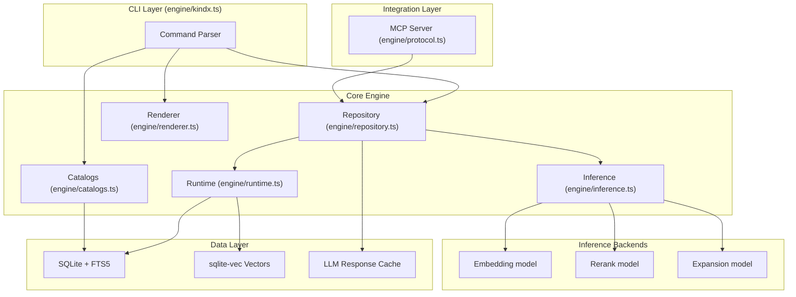
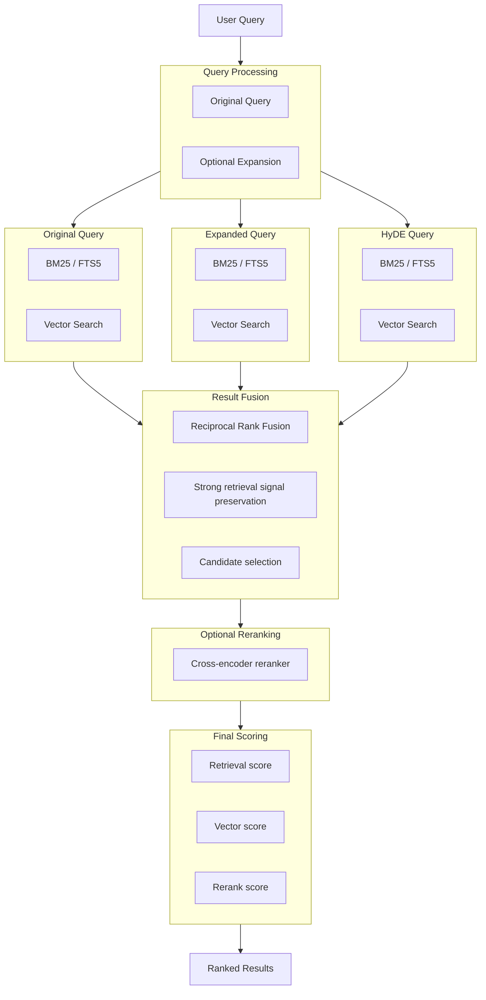
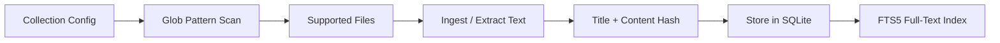
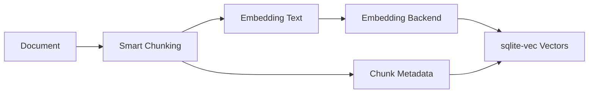

```
 ██╗  ██╗██╗███╗   ██╗██████╗ ██╗  ██╗
 ██║ ██╔╝██║████╗  ██║██╔══██╗╚██╗██╔╝
 █████╔╝ ██║██╔██╗ ██║██║  ██║ ╚███╔╝
 ██╔═██╗ ██║██║╚██╗██║██║  ██║ ██╔██╗
 ██║  ██╗██║██║ ╚████║██████╔╝██╔╝ ██╗
 ╚═╝  ╚═╝╚═╝╚═╝  ╚═══╝╚═════╝ ╚═╝  ╚═╝
```

# KINDX

[](https://modelcontextprotocol.io)
[](https://github.com/ambicuity/KINDX)
[](https://nodejs.org)
[](https://www.typescriptlang.org)
[](./LICENSE)
[](https://scorecard.dev/viewer/?uri=github.com/ambicuity/KINDX)

KINDX is an on-device knowledge index for local document collections. It provides a command-line interface, a Model Context Protocol (MCP) server, and HTTP endpoints for indexing files, searching them with SQLite FTS5/BM25 and sqlite-vec, retrieving documents, and storing scoped agent memories.

The core package is a Node.js/TypeScript project. It can run local GGUF models through `node-llama-cpp`, or use an OpenAI-compatible remote backend such as Ollama or LM Studio for embedding, expansion, and reranking.

## Features

- Index local collections configured in YAML under the KINDX config directory.
- Search with BM25 full-text queries, vector similarity, or hybrid structured queries.
- Retrieve documents by path, virtual `kindx://` path, glob, or docid.
- Serve MCP tools over stdio or Streamable HTTP.
- Expose HTTP endpoints for health, metrics, structured query, streaming query, and MCP.
- Store scoped agent memories with text and semantic search.
- Watch collections and incrementally update the index.
- Run diagnostics, cleanup, backup, restore, and shard scheduler status commands.
- Optionally extract text from PDF and DOCX files when local system tools are available.
- Provide TypeScript schema/client packages and a Python LangChain retriever wrapper.

## Tech Stack

- Node.js `>=20`, TypeScript ESM, npm workspaces
- SQLite through `better-sqlite3`; optional SQLCipher-capable runtime through `better-sqlite3-multiple-ciphers`
- SQLite FTS5 and `sqlite-vec`
- `node-llama-cpp` for local GGUF inference
- `@modelcontextprotocol/sdk` for MCP
- `chokidar`, `fast-glob`, `yaml`, and `zod`
- Vitest for TypeScript tests
- Python `>=3.10` for `python/kindx-langchain` and `training/`
- Docker runtime based on `node:22-bookworm-slim`

## Project Structure

```text
.
├── bin/kindx                  # npm executable wrapper for the compiled CLI
├── engine/                    # CLI, MCP/HTTP server, data layer, inference, memory, diagnostics
├── packages/kindx-schemas/    # shared Zod schemas and TypeScript types
├── packages/kindx-client/     # typed TypeScript client for KINDX HTTP/MCP APIs
├── python/kindx-langchain/    # Python retriever wrapper
├── specs/                     # Vitest test suite and fixtures
├── tooling/                   # release, benchmark, QA, and development utilities
├── training/                  # query-expansion training and evaluation tools
├── capabilities/kindx/        # packaged KINDX skill files
├── demo/                      # sample data, recipes, demos, and comparison fixtures
├── openclaw-integration/      # separate integration subtree
├── Dockerfile                 # multi-stage production image
├── package.json               # root package, workspace, scripts, and CLI metadata
└── sample-catalog.yml         # example collection configuration
```

## Architecture

KINDX is organized around a TypeScript CLI, an MCP/HTTP integration layer, a SQLite-backed repository layer, and local or OpenAI-compatible inference.

### Component Overview



### Hybrid Retrieval Pipeline



## Prerequisites

- Node.js `20` or newer.
- npm.
- Git, if you use collection update commands or contribute to the repository.
- Python `3.10` or newer for Python integration tests and training tools.
- Optional local tools:
  - `pdftotext` for better PDF extraction.
  - `unzip` for DOCX extraction.
  - A C/C++ build toolchain for native Node modules when prebuilt binaries are unavailable.

## Getting Started

```bash
git clone https://github.com/ambicuity/KINDX.git
cd KINDX
npm install
npm run build
```

For local CLI development, run the TypeScript entry point through the package script:

```bash
npm run kindx -- --help
```

To link the built CLI as `kindx` on your machine:

```bash
npm link
kindx --help
```

## Indexing A Collection

The quickest path is `init`, which registers a collection, indexes metadata, and generates embeddings:

```bash
npm run kindx -- init . --name notes
```

You can also run the steps separately:

```bash
npm run kindx -- collection add . --name docs
npm run kindx -- update
npm run kindx -- embed
```

Search the index:

```bash
npm run kindx -- search "authentication"
npm run kindx -- vsearch "how does authentication work"
npm run kindx -- query "authentication configuration"
```

Retrieve documents:

```bash
npm run kindx -- get "docs/architecture.md"
npm run kindx -- get "#abc123"
npm run kindx -- multi-get "docs/**/*.md"
```

## Application Entry Points

| Entry point | Purpose |
| --- | --- |
| `npm run kindx -- <args>` | Runs `engine/kindx.ts` with `tsx` for local development. |
| `bin/kindx` | npm package executable wrapper. Requires `npm run build` first in a clone. |
| `node dist/kindx.js <args>` | Runs the compiled CLI directly. |
| `kindx mcp` | Starts the MCP server over stdio. |
| `kindx mcp --http [--daemon]` | Starts the MCP HTTP server. |
| Docker `CMD` | Runs `node dist/kindx.js mcp --http --port 8181`. |

## Available Scripts

| Command | Description |
| --- | --- |
| `npm run prepare` | Installs repository hooks when `.git` exists. |
| `npm run build` | Compiles `engine/**/*.ts` to `dist/` and makes `dist/kindx.js` executable. |
| `npm run build:packages` | Builds `@ambicuity/kindx-schemas` and `@ambicuity/kindx-client`. |
| `npm run build:all` | Builds the CLI and workspace packages. |
| `npm test` | Builds the CLI, then runs Vitest tests in `specs/`. |
| `npm run test:packages` | Runs package tests for schemas and client. |
| `npm run test:python` | Runs Python unittest discovery for `python/kindx-langchain/tests`. |
| `npm run test:openclaw-integration` | Runs the configured OpenClaw integration Vitest target through pnpm. |
| `npm run test:all` | Builds all TypeScript targets, then runs root, package, and Python tests. |
| `npm run kindx -- <args>` | Runs the CLI TypeScript source with `tsx`. |
| `npm run index` | Runs `kindx index`. |
| `npm run vector` | Runs `kindx vector`. |
| `npm run search` | Runs `kindx search`. |
| `npm run vsearch` | Runs `kindx vsearch`. |
| `npm run rerank` | Runs `kindx rerank`. |
| `npm run perf:warm-daemon` | Runs the warm daemon benchmark helper. |
| `npm run perf:llm-pool-contention` | Runs the LLM pool contention benchmark helper. |
| `npm run bench:quality` | Runs enforced BM25 quality benchmarks. |
| `npm run bench:latency` | Runs latency benchmarks. |
| `npm run bench:regressions` | Runs enforced insert regression benchmarks. |
| `npm run bench:daemon` | Runs daemon load benchmarks. |
| `npm run bench:all` | Runs all enforced benchmark tracks. |
| `npm run bench:full` | Runs all benchmark tracks including optional tracks. |
| `npm run bench:section6` | Runs the Section 6 benchmark script. |
| `npm run qa:customer-pov` | Runs the P0 customer point-of-view launch gate. |
| `npm run qa:customer-pov:p0` | Writes P0 customer point-of-view results to `tooling/artifacts/customer-pov-p0.json`. |
| `npm run qa:customer-pov:p1` | Writes P1 customer point-of-view results to `tooling/artifacts/customer-pov-p1.json`. |
| `npm run qa:customer-pov:p2` | Writes P2 customer point-of-view results to `tooling/artifacts/customer-pov-p2.json`. |
| `npm run qa:customer-pov:p3` | Writes P3 customer point-of-view results to `tooling/artifacts/customer-pov-p3.json`. |
| `npm run qa:customer-pov:all` | Writes all-phase customer point-of-view results to `tooling/artifacts/customer-pov-all.json`. |
| `npm run arch:status` | Runs `kindx arch status`. |
| `npm run arch:refresh` | Runs `kindx arch refresh`. |
| `npm run inspector` | Starts the MCP inspector against `tsx engine/kindx.ts mcp`. |
| `npm run release` | Runs `tooling/release.sh`. |

## CLI Commands

Run `kindx --help` or `npm run kindx -- --help` for the full command reference.

Common commands:

| Command | Description |
| --- | --- |
| `kindx query <query>` | Hybrid search with expansion and reranking. |
| `kindx query $'lex: ...\nvec: ...'` | Structured query document with typed subqueries. |
| `kindx search <query>` | BM25/FTS full-text search. |
| `kindx vsearch <query>` | Vector similarity search. |
| `kindx get <file>[:line]` | Retrieve one document by path or docid. |
| `kindx multi-get <pattern>` | Retrieve multiple documents by glob or comma-separated list. |
| `kindx collection add <path> [--name <name>] [--mask <glob>]` | Register a collection. |
| `kindx collection list` | List configured collections. |
| `kindx context add/list/rm` | Manage human-written context annotations. |
| `kindx ls [collection[/path]]` | Inspect indexed files. |
| `kindx update [--pull]` | Re-index configured collections. |
| `kindx embed [-f] [--resume]` | Generate or refresh vector embeddings. |
| `kindx watch [collections...]` | Run the incremental indexing daemon. |
| `kindx status` | Show index and collection health. |
| `kindx pull [--refresh]` | Download or check default local GGUF models. |
| `kindx cleanup` | Clear caches and vacuum the database. |
| `kindx doctor` | Run deterministic health diagnostics. |
| `kindx repair --check-only` | Dry-run integrity and repair checks. |
| `kindx backup <create\|verify\|restore> [path]` | Manage SQLite backups. |
| `kindx scheduler status` | Show shard sync checkpoint and queue status. |
| `kindx verify-wipe` | Scan for residual local index artifacts. |
| `kindx memory <subcommand>` | Manage scoped agent memories. |
| `kindx arch <status\|build\|import\|refresh>` | Run optional Arch sidecar integration commands. |
| `kindx migrate chroma <path>` | Migrate a ChromaDB SQLite file. |
| `kindx migrate openclaw <path>` | Migrate an OpenClaw repository to use KINDX. |

## Build

```bash
npm run build
npm run build:packages
npm run build:all
```

The root build compiles `engine/**/*.ts` into `dist/`. The package build compiles the workspace packages under `packages/`.

## Testing

```bash
npm test
npm run test:packages
npm run test:python
npm run test:all
```

`npm test` runs `npm run build` first through the `pretest` script.

## Configuration

KINDX reads runtime configuration from environment variables. The repository includes `.env.example`, but the application does not load dotenv files automatically. Export variables in your shell, set them in your process manager, or pass them to Docker with `-e`.

Collection configuration is stored as YAML. By default, the config file is `~/.config/kindx/index.yml`; the example shape is shown in `sample-catalog.yml`.

Index data is stored in SQLite. By default, the database path is under `~/.cache/kindx/`, unless overridden.

### Environment Variables

| Variable | Required | Description |
| --- | ---: | --- |
| `INDEX_PATH` | No | Overrides the SQLite database path. |
| `KINDX_CONFIG_DIR` | No | Overrides the KINDX config directory. |
| `XDG_CONFIG_HOME` | No | Base directory used for config when `KINDX_CONFIG_DIR` is unset. |
| `XDG_CACHE_HOME` | No | Base directory used for cache, index, PID, model, and Arch artifact paths. |
| `HOME` | No | Used to resolve default config/cache paths and `~/` collection paths. |
| `KINDX_MCP_TOKEN` | No | Bearer token for HTTP MCP/query authentication in single-tenant mode. |
| `KINDX_HTTP_CONCURRENCY` | No | Maximum concurrent HTTP requests. Default: `150`. |
| `KINDX_MAX_CONCURRENCY_PER_TENANT` | No | Maximum concurrent HTTP requests per tenant. Default: `10`. |
| `KINDX_RATE_LIMIT_BURST` | No | Per-tenant rate-limit burst size. Default: `100`. |
| `KINDX_RATE_LIMIT_MS` | No | Rate-limit window in milliseconds. Default: `1000`. |
| `KINDX_SQLITE_DRIVER` | No | Forces a SQLite driver module. By default KINDX tries `better-sqlite3-multiple-ciphers`, then `better-sqlite3`. |
| `KINDX_ENCRYPTION_KEY` | No | Enables keyed SQLCipher runtime support when using a compatible SQLite driver. |
| `KINDX_LLM_BACKEND` | No | Set to `remote` to use the OpenAI-compatible backend; otherwise local `node-llama-cpp` is used. |
| `KINDX_CPU_ONLY` | No | Set to `1` to force local model execution on CPU. |
| `KINDX_EMBED_MODEL` | No | Local embedding model URI or model override used by inference. |
| `KINDX_RERANK_MODEL` | No | Local reranking model URI. |
| `KINDX_GENERATE_MODEL` | No | Local generation/query-expansion model URI. |
| `KINDX_OPENAI_BASE_URL` | No | Base URL for the OpenAI-compatible remote backend. Default: `http://localhost:11434/v1`. |
| `KINDX_OPENAI_API_KEY` | No | API key for the remote backend. If set, KINDX sends it as a bearer token. |
| `KINDX_OPENAI_EMBED_MODEL` | No | Remote embedding model name. |
| `KINDX_OPENAI_GENERATE_MODEL` | No | Remote generation model name. |
| `KINDX_OPENAI_RERANK_MODEL` | No | Remote reranking model name. |
| `KINDX_EXPAND_CONTEXT_SIZE` | No | Context size for expansion sessions. |
| `KINDX_RERANK_CONTEXT_SIZE` | No | Context size for reranking sessions. |
| `KINDX_VRAM_RESERVE_MB` | No | Reserve budget used by local model/device planning. |
| `KINDX_LLM_POOL_SIZE` | No | Size override for the default LLM pool. |
| `KINDX_QUERY_TIMEOUT_MS` | No | Query timeout guard. `0` disables it. |
| `KINDX_INFLIGHT_DEDUPE` | No | In-flight query deduplication mode. Supported value in code: `join`; other values disable joining. |
| `KINDX_QUERY_REPLAY_DIR` | No | Directory for query replay artifacts. |
| `KINDX_MAX_RERANK_CANDIDATES` | No | Maximum rerank candidate ceiling. |
| `KINDX_RERANK_TIMEOUT_MS` | No | Timeout budget for reranking before fallback. |
| `KINDX_RERANK_QUEUE_LIMIT` | No | Queue length cap for reranking. |
| `KINDX_RERANK_CONCURRENCY` | No | Rerank worker concurrency. |
| `KINDX_RERANK_DROP_POLICY` | No | Rerank backpressure policy: `timeout_fallback` or `wait`. |
| `KINDX_VECTOR_FANOUT_WORKERS` | No | Parallel worker cap for vector fanout. |
| `KINDX_ANN_ENABLE` | No | Enables ANN routing for sharded collections. Default: `1`. |
| `KINDX_ANN_CENTROIDS` | No | Requested centroid count for ANN shard routing. |
| `KINDX_ANN_PROBE_COUNT` | No | Number of ANN centroid probes per shard. Default: `4`. |
| `KINDX_ANN_SHORTLIST` | No | ANN shortlist size per shard. |
| `KINDX_EXTRACTOR_PDF` | No | Enables PDF extraction. Default: enabled. |
| `KINDX_EXTRACTOR_DOCX` | No | Enables DOCX extraction. Default: enabled. |
| `KINDX_EXTRACTOR_FALLBACK_POLICY` | No | PDF fallback behavior: `fallback` or `strict`. |
| `CHOKIDAR_USEPOLLING` | No | Set to `1` or `true` to make the watch daemon use polling. |
| `CHOKIDAR_INTERVAL` | No | Polling interval for `chokidar`. Default: `100`. |
| `KINDX_ARCH_ENABLED` | No | Enables Arch sidecar build/import/refresh commands. |
| `KINDX_ARCH_AUGMENT_ENABLED` | No | Enables Arch hints in query results. |
| `KINDX_ARCH_AUTO_REFRESH_ON_UPDATE` | No | Rebuilds/imports Arch artifacts after `kindx update`. |
| `KINDX_ARCH_REPO_PATH` | No | Path to the external Arch repository. Default: `./tmp/arch`. |
| `KINDX_ARCH_PYTHON_BIN` | No | Python executable for Arch commands. Default: `python3`. |
| `KINDX_ARCH_COLLECTION` | No | Collection name for imported Arch artifacts. Default: `__arch`. |
| `KINDX_ARCH_ARTIFACT_DIR` | No | Distilled Arch artifact directory. |
| `KINDX_ARCH_MIN_CONFIDENCE` | No | Minimum Arch confidence: `EXTRACTED`, `INFERRED`, or `AMBIGUOUS`. |
| `KINDX_ARCH_MAX_HINTS` | No | Maximum Arch hints per query. Default: `3`. |
| `KINDX_LOG_LEVEL` | No | Logging verbosity: `DEBUG`, `INFO`, `WARN`, or `ERROR`. |
| `KINDX_LOG_JSON` | No | Set to `1` or `true` for JSON logs. |
| `NO_COLOR` | No | Disables colored CLI output. |
| `KINDX_ENABLE_MAINTENANCE_TOOLS` | No | Exposes maintenance MCP tools such as `status`, `arch_status`, `memory_stats`, `memory_history`, `memory_mark_accessed`, `memory_delete`, and `memory_bulk`. |
| `KINDX_TRUST_UPDATE_CMDS` | No | Trusts configured collection update commands when set to `1` or `true`. |
| `KINDX_MCP_SERVERS_JSON` | No | Inline MCP control-plane server configuration. |
| `KINDX_TRUST_PROJECT` | No | Marks a project-scoped MCP control-plane config as trusted. |

## HTTP And MCP Server

Start the stdio MCP server:

```bash
kindx mcp
```

Start the HTTP server:

```bash
kindx mcp --http
kindx mcp --http --port 8080
kindx mcp --http --daemon
kindx mcp stop
```

HTTP mode uses bearer-token authentication for protected endpoints when `KINDX_MCP_TOKEN` is configured or when multi-tenant RBAC is enabled. `/health` and `/metrics` are intentionally unauthenticated.

### HTTP Endpoints

| Endpoint | Description |
| --- | --- |
| `GET /health` | Liveness response with status and uptime. |
| `GET /metrics` | Prometheus text metrics. |
| `POST /query` | Structured retrieval endpoint. |
| `POST /search` | Alias for `POST /query`. |
| `POST /query/stream` | Streaming structured query endpoint. |
| `POST /mcp` | MCP Streamable HTTP endpoint. |

`POST /query` accepts this request shape:

```json
{
  "searches": [
    { "type": "lex", "query": "authentication" },
    { "type": "vec", "query": "how authentication is configured" },
    { "type": "hyde", "query": "Authentication is configured with tokens, secrets, and middleware." }
  ],
  "limit": 10,
  "minScore": 0,
  "candidateLimit": 40,
  "collections": ["docs"]
}
```

`type` must be one of `lex`, `vec`, or `hyde`.

### MCP Tools

The server registers these core tools:

| Tool | Description |
| --- | --- |
| `query` | Structured search across one or more `lex`, `vec`, or `hyde` subqueries. |
| `get` | Retrieve one document by path or docid. |
| `multi_get` | Retrieve multiple documents by glob or list. |
| `memory_put` | Store or update a scoped memory. |
| `memory_search` | Search scoped memories by semantic or text mode. |
| `arch_query` | Retrieve optional Arch integration hints. |

Additional maintenance tools are registered only when `KINDX_ENABLE_MAINTENANCE_TOOLS` is set: `status`, `arch_status`, `memory_history`, `memory_stats`, `memory_mark_accessed`, `memory_delete`, and `memory_bulk`.

The TypeScript client exposes helpers for `/query`, `get`, `multi_get`, `status`, `memory_put`, `memory_search`, `memory_history`, and `memory_mark_accessed`.

## Docker

Build the image:

```bash
docker build -t kindx .
```

Run the HTTP MCP server on port `8181`:

```bash
docker run --rm \
  -p 8181:8181 \
  -v kindx-data:/data \
  -e KINDX_MCP_TOKEN=<token> \
  kindx
```

The Docker image sets `HOME=/data`, `KINDX_LOG_JSON=1`, and `KINDX_SQLITE_DRIVER=better-sqlite3-multiple-ciphers`.

## Workspace Packages

### `@ambicuity/kindx-schemas`

Shared Zod schemas and TypeScript types for KINDX request and response payloads.

```bash
npm run build -w @ambicuity/kindx-schemas
npm run test -w @ambicuity/kindx-schemas
```

### `@ambicuity/kindx-client`

Typed TypeScript client for the KINDX HTTP and MCP APIs.

```bash
npm run build -w @ambicuity/kindx-client
npm run test -w @ambicuity/kindx-client
```

## Python Integration

`python/kindx-langchain` contains an installable Python package named `kindx-langchain`.

```bash
python3 -m unittest discover -s python/kindx-langchain/tests -v
```

The package requires Python `>=3.10`. Its optional `langchain` extra installs `langchain-core>=0.3.0`.

## Training Tools

`training/` contains Python tooling for query-expansion fine-tuning and evaluation. It is a separate Python project named `qmd-finetune` with Python `>=3.10` and dependencies declared in `training/pyproject.toml`.

See `training/README.md` for training-specific commands.

## Database And Storage

KINDX stores indexed content in SQLite. The schema includes:

- `content` for content-addressed document bodies.
- `documents` for collection/path metadata and active document mapping.
- `documents_fts` for FTS5 full-text search.
- `content_vectors` and a sqlite-vec virtual table for vector search.
- `llm_cache` for LLM expansion/rerank cache entries.
- memory, audit, and AI usage tables initialized by the corresponding engine modules.

Collection definitions live in YAML config, not in the SQLite `collections` table.

## How It Works

### Indexing Flow



### Embedding Flow

Documents are split into chunks before embedding. The chunker prefers natural document boundaries such as headings, paragraphs, and code fences where possible.



Local inference defaults are defined in `engine/inference.ts` and can be overridden with `KINDX_EMBED_MODEL`, `KINDX_RERANK_MODEL`, and `KINDX_GENERATE_MODEL`. Set `KINDX_LLM_BACKEND=remote` to use the OpenAI-compatible backend instead of local GGUF execution.

## Contributing

See `CONTRIBUTING.md` for contributor setup and workflow details. At minimum, verify the root build and tests before opening a pull request:

```bash
npm run build
npm test
```

Security issues should be reported according to `SECURITY.md`.

## License

MIT. See `LICENSE`.
