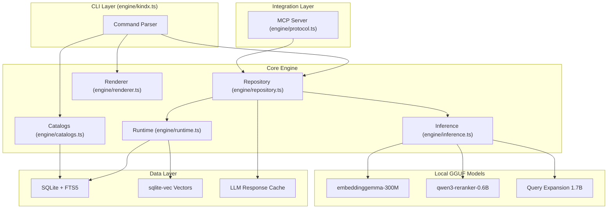
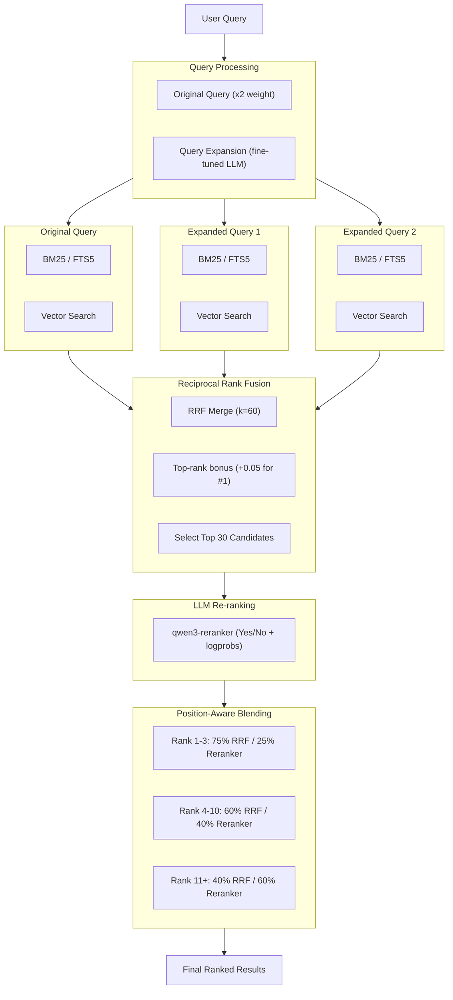
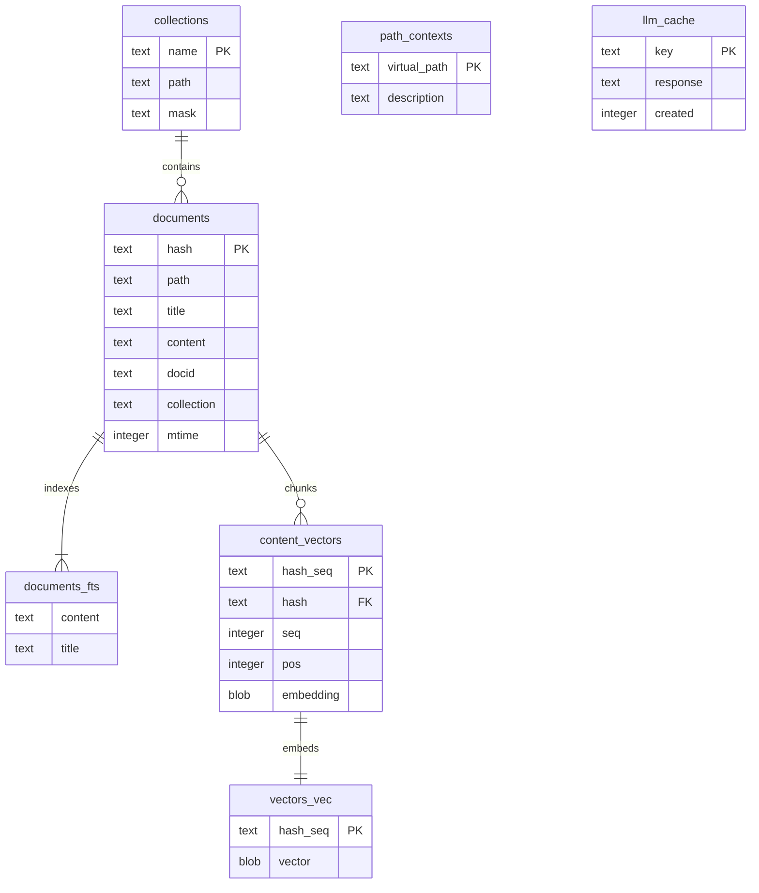
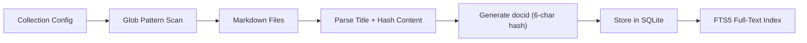
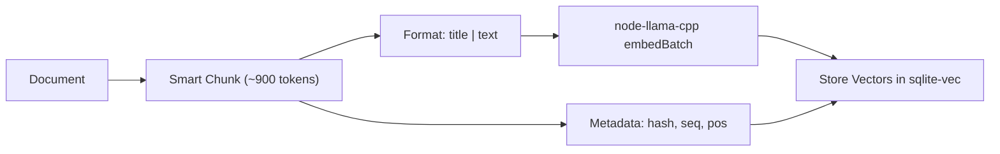

# KINDX -- On-Device Document Intelligence Engine

A local-first search engine for everything you need to remember. Index your markdown notes, meeting transcripts, documentation, and knowledge bases. Search with keywords or natural language. Designed for agentic workflows.

KINDX combines BM25 full-text search, vector semantic search, and LLM re-ranking -- all running locally via node-llama-cpp with GGUF models.

You can read more about KINDX's progress in the [CHANGELOG](./CHANGELOG.md).

## Quick Start

```bash
# Install globally (Node or Bun)
npm install -g @ambicuity/kindx
# or
bun install -g @ambicuity/kindx

# Or run directly
npx @ambicuity/kindx ...
bunx @ambicuity/kindx ...

# Create collections for your notes, docs, and meeting transcripts
kindx collection add ~/notes --name notes
kindx collection add ~/Documents/meetings --name meetings
kindx collection add ~/work/docs --name docs

# Add context to help with search results
kindx context add kindx://notes "Personal notes and ideas"
kindx context add kindx://meetings "Meeting transcripts and notes"
kindx context add kindx://docs "Work documentation"

# Generate embeddings for semantic search
kindx embed

# Search across everything
kindx search "project timeline"          # Fast keyword search
kindx vsearch "how to deploy"            # Semantic search
kindx query "quarterly planning process" # Hybrid + reranking (best quality)

# Get a specific document
kindx get "meetings/2024-01-15.md"

# Get a document by docid (shown in search results)
kindx get "#abc123"

# Get multiple documents by glob pattern
kindx multi-get "journals/2025-05*.md"

# Search within a specific collection
kindx search "API" -c notes

# Export all matches for an agent
kindx search "API" --all --files --min-score 0.3
```

### Using with AI Agents

KINDX's `--json` and `--files` output formats are designed for agentic workflows:

```bash
# Get structured results for an LLM
kindx search "authentication" --json -n 10

# List all relevant files above a threshold
kindx query "error handling" --all --files --min-score 0.4

# Retrieve full document content
kindx get "docs/api-reference.md" --full
```

### MCP Server

Although the tool works perfectly fine when you just tell your agent to use it on the command line, it also exposes an MCP (Model Context Protocol) server for tighter integration.

Tools exposed:
- `kindx_search` -- Fast BM25 keyword search (supports collection filter)
- `kindx_vector_search` -- Semantic vector search (supports collection filter)
- `kindx_deep_search` -- Deep search with query expansion and reranking (supports collection filter)
- `kindx_get` -- Retrieve document by path or docid (with fuzzy matching suggestions)
- `kindx_multi_get` -- Retrieve multiple documents by glob pattern, list, or docids
- `kindx_status` -- Index health and collection info

Claude Desktop configuration (`~/Library/Application Support/Claude/claude_desktop_config.json`):

```json
{
  "mcpServers": {
    "kindx": {
      "command": "kindx",
      "args": ["mcp"]
    }
  }
}
```

#### HTTP Transport

By default, KINDX's MCP server uses stdio (launched as a subprocess by each client). For a shared, long-lived server that avoids repeated model loading, use the HTTP transport:

```bash
# Foreground (Ctrl-C to stop)
kindx mcp --http                # localhost:8181
kindx mcp --http --port 8080    # custom port

# Background daemon
kindx mcp --http --daemon       # start, writes PID to ~/.cache/kindx/mcp.pid
kindx mcp stop                  # stop via PID file
kindx status                    # shows "MCP: running (PID ...)" when active
```

The HTTP server exposes two endpoints:
- `POST /mcp` -- MCP Streamable HTTP (JSON responses, stateless)
- `GET /health` -- liveness check with uptime

LLM models stay loaded in VRAM across requests. Embedding/reranking contexts are disposed after 5 min idle and transparently recreated on the next request (~1s penalty, models remain loaded).

Point any MCP client at `http://localhost:8181/mcp` to connect.

## Architecture

### Component Overview



### Hybrid Search Pipeline



### Score Normalization and Fusion

#### Search Backends

- **BM25 (FTS5)**: `Math.abs(score)` normalized via `score / 10`
- **Vector search**: `1 / (1 + distance)` cosine similarity

#### Fusion Strategy

The `query` command uses Reciprocal Rank Fusion (RRF) with position-aware blending:

1. **Query Expansion**: Original query (x2 for weighting) + 1 LLM variation
2. **Parallel Retrieval**: Each query searches both FTS and vector indexes
3. **RRF Fusion**: Combine all result lists using `score = Sum(1/(k+rank+1))` where k=60
4. **Top-Rank Bonus**: Documents ranking #1 in any list get +0.05, #2-3 get +0.02
5. **Top-K Selection**: Take top 30 candidates for reranking
6. **Re-ranking**: LLM scores each document (yes/no with logprobs confidence)
7. **Position-Aware Blending**:
   - RRF rank 1-3: 75% retrieval, 25% reranker (preserves exact matches)
   - RRF rank 4-10: 60% retrieval, 40% reranker
   - RRF rank 11+: 40% retrieval, 60% reranker (trust reranker more)

Why this approach: Pure RRF can dilute exact matches when expanded queries don't match. The top-rank bonus preserves documents that score #1 for the original query. Position-aware blending prevents the reranker from destroying high-confidence retrieval results.

## Requirements

### System Requirements

- Node.js >= 22
- Bun >= 1.0.0
- macOS: Homebrew SQLite (for extension support)

```bash
brew install sqlite
```

### GGUF Models (via node-llama-cpp)

KINDX uses three local GGUF models (auto-downloaded on first use):

- `embeddinggemma-300M-Q8_0` -- embedding model
- `qwen3-reranker-0.6b-q8_0` -- cross-encoder reranker
- `kindx-query-expansion-1.7B-q4_k_m` -- query expansion (fine-tuned)

Models are downloaded from HuggingFace and cached in `~/.cache/kindx/models/`.

### Custom Embedding Model

Override the default embedding model via the `KINDX_EMBED_MODEL` environment variable. This is useful for multilingual corpora (e.g. Chinese, Japanese, Korean) where embeddinggemma-300M has limited coverage.

```bash
# Use Qwen3-Embedding-0.6B for better multilingual (CJK) support
export KINDX_EMBED_MODEL="hf:Qwen/Qwen3-Embedding-0.6B-GGUF/qwen3-embedding-0.6b-q8_0.gguf"

# After changing the model, re-embed all collections:
kindx embed -f
```

Supported model families:
- **embeddinggemma** (default) -- English-optimized, small footprint
- **Qwen3-Embedding** -- Multilingual (119 languages including CJK), MTEB top-ranked

Note: When switching embedding models, you must re-index with `kindx embed -f` since vectors are not cross-compatible between models. The prompt format is automatically adjusted for each model family.

## Installation

```bash
npm install -g @ambicuity/kindx
# or
bun install -g @ambicuity/kindx
```

### Development

```bash
git clone https://github.com/ambicuity/KINDX
cd KINDX
npm install
npm link
```

## Usage

### Collection Management

```bash
# Create a collection from current directory
kindx collection add . --name myproject

# Create a collection with explicit path and custom glob mask
kindx collection add ~/Documents/notes --name notes --mask "**/*.md"

# List all collections
kindx collection list

# Remove a collection
kindx collection remove myproject

# Rename a collection
kindx collection rename myproject my-project

# List files in a collection
kindx ls notes
kindx ls notes/subfolder
```

### Generate Vector Embeddings

```bash
# Embed all indexed documents (900 tokens/chunk, 15% overlap)
kindx embed

# Force re-embed everything
kindx embed -f
```

### Context Management

Context adds descriptive metadata to collections and paths, helping search understand your content.

```bash
# Add context to a collection (using kindx:// virtual paths)
kindx context add kindx://notes "Personal notes and ideas"
kindx context add kindx://docs/api "API documentation"

# Add context from within a collection directory
cd ~/notes && kindx context add "Personal notes and ideas"
cd ~/notes/work && kindx context add "Work-related notes"

# Add global context (applies to all collections)
kindx context add / "Knowledge base for my projects"

# List all contexts
kindx context list

# Remove context
kindx context rm kindx://notes/old
```

### Search Commands

```
+------------------------------------------------------------+
| Search Modes                                               |
+----------+-------------------------------------------------+
| search   | BM25 full-text search only                      |
| vsearch  | Vector semantic search only                     |
| query    | Hybrid: FTS + Vector + Query Expansion + Rerank |
+----------+-------------------------------------------------+
```

```bash
# Full-text search (fast, keyword-based)
kindx search "authentication flow"

# Vector search (semantic similarity)
kindx vsearch "how to login"

# Hybrid search with re-ranking (best quality)
kindx query "user authentication"
```

### Options

```bash
# Search options
-n <num>           # Number of results (default: 5, or 20 for --files/--json)
-c, --collection   # Restrict search to a specific collection
--all              # Return all matches (use with --min-score to filter)
--min-score <num>  # Minimum score threshold (default: 0)
--full             # Show full document content
--line-numbers     # Add line numbers to output
--explain          # Include retrieval score traces (query, JSON/CLI output)
--index <name>     # Use named index

# Output formats (for search and multi-get)
--files            # Output: docid,score,filepath,context
--json             # JSON output with snippets
--csv              # CSV output
--md               # Markdown output
--xml              # XML output

# Get options
kindx get <file>[:line]  # Get document, optionally starting at line
-l <num>                 # Maximum lines to return
--from <num>             # Start from line number

# Multi-get options
-l <num>                 # Maximum lines per file
--max-bytes <num>        # Skip files larger than N bytes (default: 10KB)
```

### Index Maintenance

```bash
# Show index status and collections with contexts
kindx status

# Re-index all collections
kindx update

# Re-index with git pull first (for remote repos)
kindx update --pull

# Get document by filepath (with fuzzy matching suggestions)
kindx get notes/meeting.md

# Get document by docid (from search results)
kindx get "#abc123"

# Get document starting at line 50, max 100 lines
kindx get notes/meeting.md:50 -l 100

# Get multiple documents by glob pattern
kindx multi-get "journals/2025-05*.md"

# Get multiple documents by comma-separated list (supports docids)
kindx multi-get "doc1.md, doc2.md, #abc123"

# Limit multi-get to files under 20KB
kindx multi-get "docs/*.md" --max-bytes 20480

# Output multi-get as JSON for agent processing
kindx multi-get "docs/*.md" --json

# Clean up cache and orphaned data
kindx cleanup
```

## Data Storage

Index stored in: `~/.cache/kindx/index.sqlite`

### Schema



## Environment Variables

| Variable | Default | Description |
|----------|---------|-------------|
| `KINDX_EMBED_MODEL` | `embeddinggemma-300M` | Override embedding model (HuggingFace URI) |
| `KINDX_EXPAND_CONTEXT_SIZE` | `2048` | Context window for query expansion |
| `KINDX_CONFIG_DIR` | `~/.config/kindx` | Configuration directory override |
| `XDG_CACHE_HOME` | `~/.cache` | Cache base directory |
| `NO_COLOR` | (unset) | Disable terminal colors |

## How It Works

### Indexing Flow



### Embedding Flow

Documents are chunked into ~900-token pieces with 15% overlap using smart boundary detection:



### Smart Chunking

Instead of cutting at hard token boundaries, KINDX uses a scoring algorithm to find natural markdown break points. This keeps semantic units (sections, paragraphs, code blocks) together.

Algorithm:
1. Scan document for all break points with scores
2. When approaching the 900-token target, search a 200-token window before the cutoff
3. Score each break point: `finalScore = baseScore x (1 - (distance/window)^2 x 0.7)`
4. Cut at the highest-scoring break point

The squared distance decay means a heading 200 tokens back (score ~30) still beats a simple line break at the target (score 1), but a closer heading wins over a distant one.

Code Fence Protection: Break points inside code blocks are ignored -- code stays together. If a code block exceeds the chunk size, it is kept whole when possible.

### Model Configuration

Models are configured in `engine/inference.ts` as HuggingFace URIs:

```typescript
const DEFAULT_EMBED_MODEL = "hf:ggml-org/embeddinggemma-300M-GGUF/embeddinggemma-300M-Q8_0.gguf";
const DEFAULT_RERANK_MODEL = "hf:ggml-org/Qwen3-Reranker-0.6B-Q8_0-GGUF/qwen3-reranker-0.6b-q8_0.gguf";
const DEFAULT_GENERATE_MODEL = "hf:ambicuity/kindx-query-expansion-1.7B-gguf/kindx-query-expansion-1.7B-q4_k_m.gguf";
```

## Contributing

See [CONTRIBUTING.md](./CONTRIBUTING.md) for the full contribution guide.

## Security

See [SECURITY.md](./SECURITY.md) for reporting vulnerabilities.

## License

MIT -- see [LICENSE](./LICENSE) for details.

---

Maintained by [Ritesh Rana](https://github.com/ambicuity) -- `contact@riteshrana.engineer`
