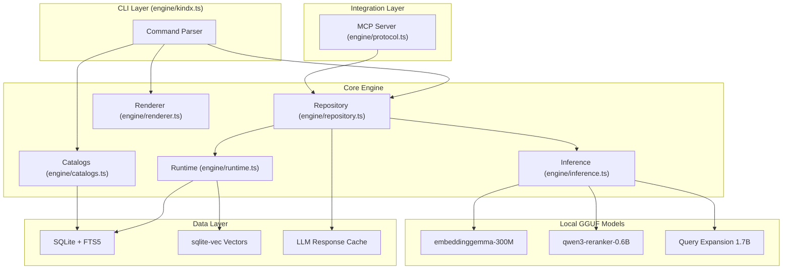
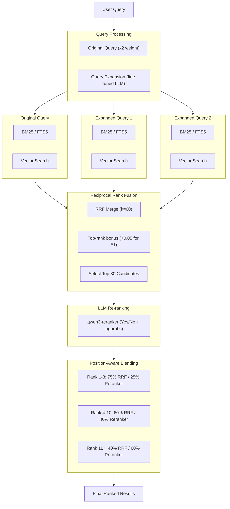
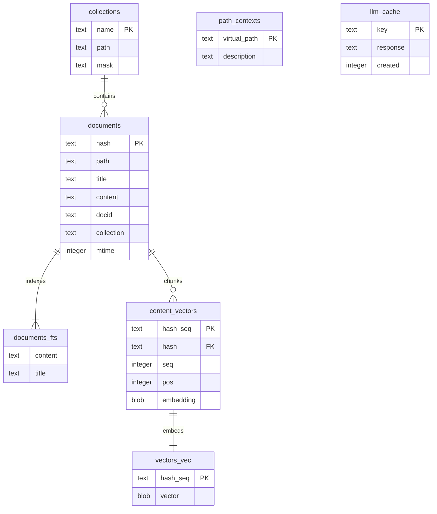
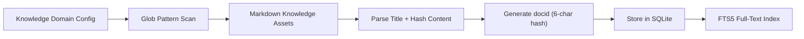
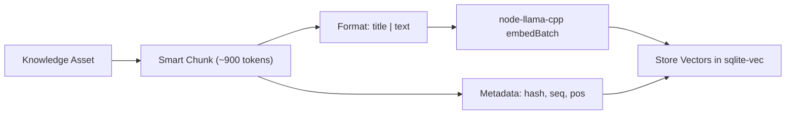

```
 ██╗  ██╗██╗███╗   ██╗██████╗ ██╗  ██╗
 ██║ ██╔╝██║████╗  ██║██╔══██╗╚██╗██╔╝
 █████╔╝ ██║██╔██╗ ██║██║  ██║ ╚███╔╝
 ██╔═██╗ ██║██║╚██╗██║██║  ██║ ██╔██╗
 ██║  ██╗██║██║ ╚████║██████╔╝██╔╝ ██╗
 ╚═╝  ╚═╝╚═╝╚═╝  ╚═══╝╚═════╝ ╚═╝  ╚═╝
```

# KINDX — Enterprise-Grade On-Device Knowledge Infrastructure

[](https://modelcontextprotocol.io)
[](https://github.com/ambicuity/KINDX)
[](https://nodejs.org)
[](https://www.typescriptlang.org)
[](./LICENSE)
[](https://scorecard.dev/viewer/?uri=github.com/ambicuity/KINDX)

**Knowledge Infrastructure for AI Agents.** KINDX is a high-performance, local-first backend for Agentic Context Injection — enabling AI agents to perform deterministic, privacy-preserving Contextual Retrieval over enterprise corpora without a single byte leaving the edge.

KINDX combines BM25 full-text retrieval, vector semantic retrieval, and LLM re-ranking — all running locally via `node-llama-cpp` with GGUF models. It is designed to be called by agents, not typed by humans.

> Read the progress log in the [CHANGELOG](./CHANGELOG.md).

---

## The Three Pillars

### 1. Deterministic Privacy
Every inference — embedding, reranking, query expansion — runs on local GGUF models via `node-llama-cpp`. Sensitive Knowledge Assets never leave the edge. There is no telemetry, no API call, no cloud dependency.

### 2. Agent-Native Design
KINDX is architected for `child_process` invocation from autonomous agents (AutoGPT, OpenDevin, Claude Code, LangGraph). The `--json`, `--files`, `--csv`, and `--xml` output flags produce structured payloads for agent consumption. The MCP server provides tight protocol-level integration.

### 3. Hybrid Precision (Neural-Symbolic Retrieval)
Position-Aware Blending merges BM25 symbolic retrieval with neural vector similarity and LLM cross-encoder reranking. The fusion strategy is provably non-destructive to exact-match signals via Reciprocal Rank Fusion (RRF, k=60). See the [Architecture](#architecture) section for the full pipeline specification.

---

## Quick Start — Local-First Agentic Stack

```bash
# Install globally (Node or Bun)
npm install -g @ambicuity/kindx
# or
bun install -g @ambicuity/kindx

# Or invoke without installing
npx @ambicuity/kindx ...
bunx @ambicuity/kindx ...

> **Note:** The term "Knowledge Domain" in this documentation corresponds to a `collection` in the CLI.

# Register Knowledge Domains
kindx collection add ~/notes --name notes
kindx collection add ~/Documents/meetings --name meetings
kindx collection add ~/work/docs --name docs

# Annotate Knowledge Domains with semantic context
kindx context add kindx://notes "Personal knowledge assets and ideation corpus"
kindx context add kindx://meetings "Meeting transcripts and decision records"
kindx context add kindx://docs "Engineering documentation corpus"

# Build the vector index from corpus
kindx embed

# Contextual Retrieval — choose retrieval mode
kindx search "project timeline"          # BM25 full-text retrieval (fast)
kindx vsearch "how to deploy"            # Neural vector retrieval
kindx query "quarterly planning process" # Hybrid + reranking (highest precision)

# Neural Extraction — retrieve a specific Knowledge Asset
kindx get "meetings/2024-01-15.md"

# Neural Extraction by docid (shown in retrieval results)
kindx get "#abc123"

# Bulk Neural Extraction via glob pattern
kindx multi-get "journals/2025-05*.md"

# Scoped Contextual Retrieval within a Knowledge Domain
kindx search "API" -c notes

# Export full match set for agent pipeline
kindx search "API" --all --files --min-score 0.3
```

---

## Agent-Native Integration

KINDX's primary interface is structured output for agent pipelines. Treat CLI invocations as RPC calls.

```bash
# Structured JSON payload for LLM context injection
kindx search "authentication" --json -n 10

# Filepath manifest above relevance threshold — agent file consumption
kindx query "error handling" --all --files --min-score 0.4

# Full Knowledge Asset content for agent context window
kindx get "docs/api-reference.md" --full
```

> **Pro-tip (Agentic Performance):** Prefer `kindx query` over `kindx search` for open-ended agent instructions. The query expansion and LLM re-ranking pipeline surfaces semantically adjacent Knowledge Assets that keyword retrieval misses.

> **Pro-tip (Context Window Budgeting):** Use `--min-score 0.4` with `--files` to produce a ranked manifest, then `multi-get` only the top-k assets. This two-phase pattern prevents context window overflow while preserving retrieval precision.

---

## MCP Server

KINDX exposes a Model Context Protocol (MCP) server for tool-call integration with any MCP-compatible agent runtime.

**Registered Tools:**
- `kindx_search` — BM25 Contextual Retrieval (supports Knowledge Domain filter)
- `kindx_vector_search` — Neural vector Contextual Retrieval (supports Knowledge Domain filter)
- `kindx_deep_search` — Hybrid Neural-Symbolic retrieval with query expansion and reranking (supports Knowledge Domain filter)
- `kindx_get` — Neural Extraction by path or docid (with fuzzy matching fallback)
- `kindx_multi_get` — Bulk Neural Extraction by glob pattern, list, or docids
- `kindx_status` — Index health and Knowledge Domain inventory

**Claude Desktop configuration** (`~/Library/Application Support/Claude/claude_desktop_config.json`):

```json
{
  "mcpServers": {
    "kindx": {
      "command": "kindx",
      "args": ["mcp"]
    }
  }
}
```

### HTTP Transport

By default, the MCP server uses stdio (launched as a subprocess per client). For a shared, long-lived server that avoids repeated model loading across agent sessions, use the HTTP transport:

```bash
# Foreground
kindx mcp --http                # localhost:8181
kindx mcp --http --port 8080    # custom port

# Persistent daemon
kindx mcp --http --daemon       # writes PID to ~/.cache/kindx/mcp.pid
kindx mcp stop                  # terminate via PID file
kindx status                    # reports "MCP: running (PID ...)"
```

Endpoints:
- `POST /mcp` — MCP Streamable HTTP (JSON, stateless)
- `GET /health` — liveness probe with uptime

LLM models remain resident in VRAM across requests. Embedding and reranking contexts are disposed after 5 min idle and transparently recreated on next request (~1 s penalty, models remain warm).

Point any MCP client at `http://localhost:8181/mcp`.

> **Pro-tip (Multi-Agent Deployments):** Run `kindx mcp --http --daemon` once at agent-cluster startup. All child agents share a single warm model context, eliminating per-invocation model load overhead (~3–8 s per cold start).

---

## Architecture

### Component Overview



### Hybrid Retrieval Pipeline



### Score Normalization and Fusion

#### Retrieval Backends

- **BM25 (FTS5)**: `Math.abs(score)` normalized via `score / 10`
- **Vector retrieval**: `1 / (1 + distance)` cosine similarity

#### Fusion Strategy

The `query` command uses Reciprocal Rank Fusion (RRF) with position-aware blending:

1. **Query Expansion**: Original query (x2 for weighting) + 1 LLM variation
2. **Parallel Retrieval**: Each query searches both FTS and vector indexes
3. **RRF Fusion**: Combine all result lists using `score = Sum(1/(k+rank+1))` where k=60
4. **Top-Rank Bonus**: Knowledge Assets ranking #1 in any list get +0.05, #2-3 get +0.02
5. **Top-K Selection**: Take top 30 candidates for reranking
6. **Re-ranking**: LLM scores each asset (yes/no with logprobs confidence)
7. **Position-Aware Blending**:
   - RRF rank 1-3: 75% retrieval, 25% reranker (preserves exact matches)
   - RRF rank 4-10: 60% retrieval, 40% reranker
   - RRF rank 11+: 40% retrieval, 60% reranker (trust reranker more)

**Design rationale:** Pure RRF can dilute exact matches when expanded queries don't match. The top-rank bonus preserves Knowledge Assets that score #1 for the original query. Position-aware blending prevents the reranker from overriding high-confidence retrieval signals.

---

## Requirements

### System Requirements

- Node.js >= 22
- Bun >= 1.0.0
- macOS: Homebrew SQLite (for extension support)

```bash
brew install sqlite
```

### GGUF Models (via node-llama-cpp)

KINDX uses three local GGUF models (auto-downloaded on first use):

- `embeddinggemma-300M-Q8_0` — embedding model
- `qwen3-reranker-0.6b-q8_0` — cross-encoder reranker
- `kindx-query-expansion-1.7B-q4_k_m` — query expansion (fine-tuned)

Models are downloaded from HuggingFace and cached in `~/.cache/kindx/models/`.

> **Pro-tip (Air-Gapped Deployments):** Pre-download all three GGUF files and place them in `~/.cache/kindx/models/`. KINDX resolves models from the local cache first; no network access is required at runtime.

### Custom Embedding Model

Override the default embedding model via the `KINDX_EMBED_MODEL` environment variable. Required for multilingual corpora (CJK, Arabic, etc.) where `embeddinggemma-300M` has limited coverage.

```bash
# Use Qwen3-Embedding-0.6B for multilingual corpus (CJK) support
export KINDX_EMBED_MODEL="hf:Qwen/Qwen3-Embedding-0.6B-GGUF/qwen3-embedding-0.6b-q8_0.gguf"

# Force re-embed all Knowledge Assets after model switch
kindx embed -f
```

Supported model families:

| Model | Use Case |
|---|---|
| `embeddinggemma` (default) | English-optimized, minimal footprint |
| `Qwen3-Embedding` | Multilingual (119 languages including CJK), MTEB top-ranked |

> **Note:** Switching embedding models requires full re-indexing (`kindx embed -f`). Vectors are model-specific and not cross-compatible. The prompt format is automatically adjusted per model family.

---

## Installation

```bash
npm install -g @ambicuity/kindx
# or
bun install -g @ambicuity/kindx
```

### Development

```bash
git clone https://github.com/ambicuity/KINDX
cd KINDX
npm install
npm link
```

---

## Usage Reference

### Knowledge Domain Management

```bash
# Register a Knowledge Domain from current directory
kindx collection add . --name myproject

# Register with explicit path and glob mask
kindx collection add ~/Documents/notes --name notes --mask "**/*.md"

# List all registered Knowledge Domains
kindx collection list

# Remove a Knowledge Domain
kindx collection remove myproject

# Rename a Knowledge Domain
kindx collection rename myproject my-project

# List Knowledge Assets within a domain
kindx ls notes
kindx ls notes/subfolder
```

### Vector Index Generation

```bash
# Embed all indexed Knowledge Assets (900 tokens/chunk, 15% overlap)
kindx embed

# Force re-embed entire corpus
kindx embed -f
```

### Context Management

Context annotations add semantic metadata to Knowledge Domains and paths, improving Contextual Retrieval precision.

```bash
# Annotate a Knowledge Domain (using kindx:// virtual paths)
kindx context add kindx://notes "Personal knowledge assets and ideation corpus"
kindx context add kindx://docs/api "API and integration documentation corpus"

# Annotate from within a corpus directory
cd ~/notes && kindx context add "Personal knowledge assets and ideas"
cd ~/notes/work && kindx context add "Work-related knowledge corpus"

# Add global context (applies across all Knowledge Domains)
kindx context add / "Enterprise knowledge base for agent context injection"

# List all context annotations
kindx context list

# Remove context annotation
kindx context rm kindx://notes/old
```

### Contextual Retrieval Commands

```
+------------------------------------------------------------+
| Retrieval Modes                                            |
+----------+-------------------------------------------------+
| search   | BM25 full-text retrieval only                  |
| vsearch  | Neural vector retrieval only                   |
| query    | Hybrid: FTS + Vector + Expansion + Rerank      |
+----------+-------------------------------------------------+
```

```bash
# Full-text Contextual Retrieval (fast, keyword-based)
kindx search "authentication flow"

# Neural vector Contextual Retrieval (semantic similarity)
kindx vsearch "how to login"

# Hybrid Neural-Symbolic retrieval with re-ranking (highest precision)
kindx query "user authentication"
```

### CLI Options

```bash
# Retrieval options
-n <num>           # Number of results (default: 5, or 20 for --files/--json)
-c, --collection   # Restrict retrieval to a specific Knowledge Domain
--all              # Return all matches (combine with --min-score to filter)
--min-score <num>  # Minimum relevance threshold (default: 0)
--full             # Return full Knowledge Asset content
--line-numbers     # Annotate output with line numbers
--explain          # Include retrieval score traces (query, JSON/CLI output)
--index <name>     # Use named index

# Structured output formats (for agent pipeline consumption)
--files            # Output: docid,score,filepath,context
--json             # JSON payload with snippets
--csv              # CSV output
--md               # Markdown output
--xml              # XML output

# Neural Extraction options
kindx get <file>[:line]  # Extract Knowledge Asset, optionally from line offset
-l <num>                 # Maximum lines to return
--from <num>             # Start from line number

# Bulk Neural Extraction options
-l <num>                 # Maximum lines per asset
--max-bytes <num>        # Skip assets larger than N bytes (default: 10KB)
```

### Index Maintenance

```bash
# Report index health and Knowledge Domain inventory
kindx status

# Re-index all Knowledge Domains
kindx update

# Re-index with upstream git pull (for remote corpus repos)
kindx update --pull

# Neural Extraction by filepath (with fuzzy matching fallback)
kindx get notes/meeting.md

# Neural Extraction by docid (from retrieval results)
kindx get "#abc123"

# Extract Knowledge Asset starting at line 50, max 100 lines
kindx get notes/meeting.md:50 -l 100

# Bulk Neural Extraction via glob pattern
kindx multi-get "journals/2025-05*.md"

# Bulk Neural Extraction via comma-separated list (supports docids)
kindx multi-get "doc1.md, doc2.md, #abc123"

# Limit bulk extraction to assets under 20KB
kindx multi-get "docs/*.md" --max-bytes 20480

# Export bulk extraction as JSON for agent processing
kindx multi-get "docs/*.md" --json

# Purge cache and orphaned index data
kindx cleanup
```

---

## Data Storage

Index stored at: `~/.cache/kindx/index.sqlite`

### Schema



---

## Environment Variables

| Variable | Default | Description |
|----------|---------|-------------|
| `KINDX_EMBED_MODEL` | `embeddinggemma-300M` | Override embedding model (HuggingFace URI) |
| `KINDX_EXPAND_CONTEXT_SIZE` | `2048` | Context window for query expansion LLM |
| `KINDX_CONFIG_DIR` | `~/.config/kindx` | Configuration directory override |
| `XDG_CACHE_HOME` | `~/.cache` | Cache base directory |
| `NO_COLOR` | (unset) | Disable ANSI terminal colors |

---

## How It Works

### Indexing Flow



### Embedding Flow

Knowledge Assets are chunked into ~900-token pieces with 15% overlap using smart boundary detection:



### Smart Chunking

Instead of cutting at hard token boundaries, KINDX uses a scoring algorithm to find natural markdown break points. This keeps semantic units (sections, paragraphs, code blocks) together within a single chunk.

**Algorithm:**
1. Scan Knowledge Asset for all break points with scores
2. When approaching the 900-token target, search a 200-token window before the cutoff
3. Score each break point: `finalScore = baseScore x (1 - (distance/window)^2 x 0.7)`
4. Cut at the highest-scoring break point

The squared distance decay means a heading 200 tokens back (score ~30) still beats a simple line break at the target (score 1), but a closer heading wins over a distant one.

**Code Fence Protection:** Break points inside code blocks are ignored — code stays together. If a code block exceeds the chunk size, it is kept whole when possible.

### Model Configuration

Models are configured in `engine/inference.ts` as HuggingFace URIs:

```typescript
const DEFAULT_EMBED_MODEL = "hf:ggml-org/embeddinggemma-300M-GGUF/embeddinggemma-300M-Q8_0.gguf";
const DEFAULT_RERANK_MODEL = "hf:ggml-org/Qwen3-Reranker-0.6B-Q8_0-GGUF/qwen3-reranker-0.6b-q8_0.gguf";
const DEFAULT_GENERATE_MODEL = "hf:ambicuity/kindx-query-expansion-1.7B-gguf/kindx-query-expansion-1.7B-q4_k_m.gguf";
```

---

## Contributing

See [CONTRIBUTING.md](./CONTRIBUTING.md) for the full contribution guide and The KINDX Specification.

## Security

See [SECURITY.md](./SECURITY.md) for vulnerability disclosure.

## License

MIT — see [LICENSE](./LICENSE) for details.

---

Maintained by [Ritesh Rana](https://github.com/ambicuity) — `contact@riteshrana.engineer`
